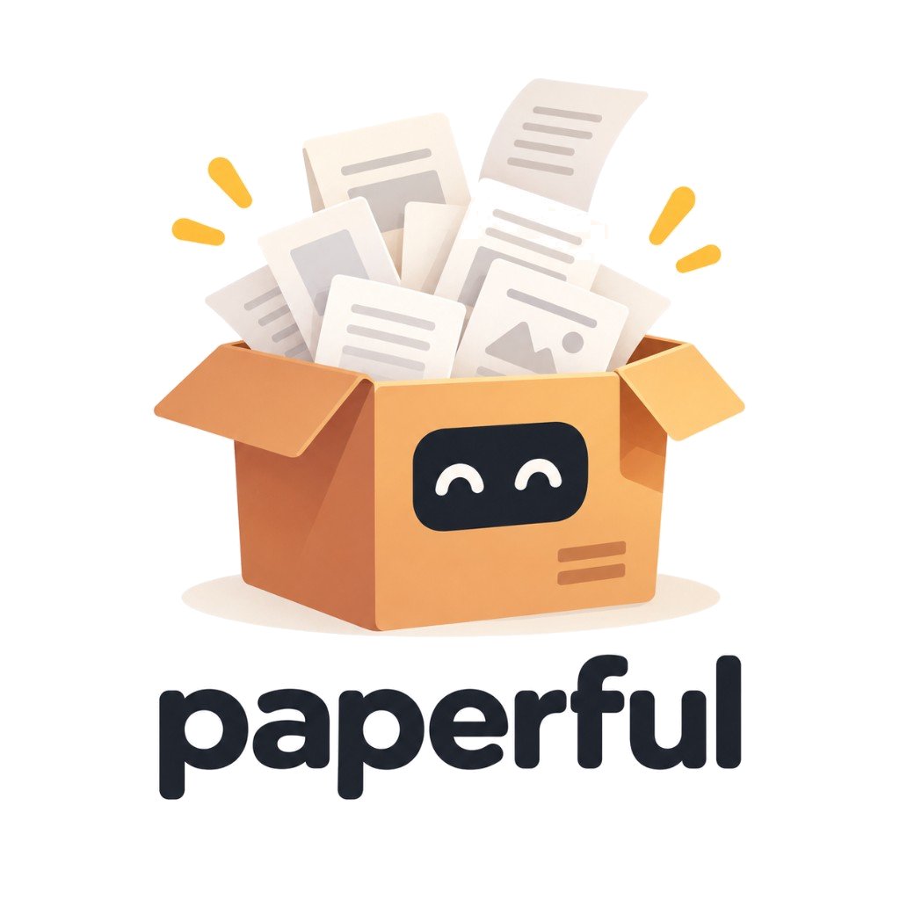

<h1 align="center">
  
</h1>

<p align="center">
  <a href="https://github.com/glen-w/Paperful/actions/workflows/ci.yml"></a>
  
  
  <a href="LICENSE"></a>
</p>

<p align="center">
  <strong>Clean the library. Find the PDFs. Keep a mirror.</strong>
</p>

<p align="center">
  <strong>Not affiliated with paperful.io.</strong>
  Local Compose sidecar, not a document-infra service.
  Not a sync service. Not every paywalled or DOI-less item comes back.
  Zotero is the well-tested adapter. Mendeley and EndNote are seeking testers.
</p>

Five jobs: **library**, **find**, **completeness**, **mirror**, **control**.
The live catalogue is an adapter. Zotero’s local API is the one that is well
tested. Mendeley and EndNote are in the tree and seeking testers — do not
treat them as proven. Why this shape: [Why paperful](docs/why.md). Not sure
this is the right tool? [How paperful compares](docs/comparison.md).

**Library.** Collections, years, and item types are the scope. `import` and
`export` speak RIS, BibTeX, and EndNote XML.

**Snowball grows. Run fills.** `snowball` proposes new works and creates
metadata parents only when the gate says so. `run` fetches PDFs for items
already in the library. Dry-run is the default for snowball; `run` attaches
on Zotero 10+ unless you pass `--dry-run`. See [Snowball](docs/snowball.md)
and [how a hop is cut](docs/snowball.md#how-a-hop-is-cut).

```sh
docker compose run --rm paperful snowball search "area based management" --gate dry-run
docker compose run --rm paperful run --collection interesting --preset oa --dry-run
```

**Find.** Open access first (Unpaywall, OpenAlex, arXiv, bioRxiv/medRxiv,
Europe PMC, Semantic Scholar, CORE, the item's own URL). Campus **EZProxy**
when you have a subscription. User playbooks, then an opt-in AI browser, take
the landings those indexes miss. **Google Scholar** and **Sci-Hub** are
opt-in and off by default (Scholar needs a session login; Sci-Hub occupies a
legal grey zone in some jurisdictions — see [Sci-Hub](docs/scihub.md)). Each
item only hits sources that match its metadata (DOI, arXiv id, URL, …);
`--try-all` disables that. Sci-Hub coverage after ~2021 is thin — paperful
skips Sci-Hub for items dated after 2021 (and drops it from the run when
`--year-from` is past that year). Recent paywalled papers are a campus-access
problem when your library has the subscription. Paperful does not fetch every
paywalled or DOI-less item. Attachments carry a provenance note
(`paperful oa:unpaywall`, `campus:ezproxy`, `grey:undocs`) so you can see
where a PDF came from.

**Completeness.** `gaps` counts what is missing. `lint` and `fix-metadata`
propose patches on disk; `--apply` writes them. `dedupe` reviews duplicates, then merges the extra parent's PDF, notes,
and better fields onto the keeper only when you say so. `summarize` writes a grounded note
from a text-layer PDF; `synthesize` reviews those notes. `paperful all` runs
gaps → find → lint → fix → summarise. The model is off until `[llm].enabled`.
`paperful ocr --apply` adds a text layer to scanned PDFs on disk.

**Mirror.** Work happens **on disk** (`out/`, `state/`). `snapshot` writes one
folder per scoped item (`record.json`, optional PDF, notes). `restore --apply`
recreates only what the live catalogue is missing and does not overwrite
fields already there. Copy `out/` yourself; paperful is not a sync service.

**Control.** Downloads and proposals land on disk first. Write-back is a
separate step. Dry-run before a big fetch. Docker runs the tool; Zotero and
headed `session login` stay on the host. Python, the Zotero local API, Ollama
or LiteLLM.

Hosted site (GitHub Pages): landing in [`website/`](website/) plus Sphinx HTML
from this `docs/` tree at `/guide/`. Preview locally with
`uv sync --extra docs && make pages-site`, then open `_site/index.html`.
Live: [glenwright.earth/Paperful](https://glenwright.earth/Paperful/).

## Is this the right tool?

Yes, if you use Zotero, want an on-disk mirror, and will run a CLI in Docker.
Maybe, if Zotero’s own “find available PDF” already covers you.
No, if you want a GUI, OCR, a sync service, or every paywalled PDF.
Mendeley and EndNote are not proven. [Why](docs/why.md) · [Comparison](docs/comparison.md).

## Quick start

Tagged **v0.9** means clone and build. There is no GitHub Release binary, no
published image, and no PyPI package: do not `docker pull` or
`pip install paperful`. Zotero and headed `session login` stay on the host.
Work lands on disk (`out/`, `state/`).

**You need**

- [Docker](https://docs.docker.com/get-docker/) with Compose v2.
- Zotero **on the host** (not in Docker), local API enabled:
  Settings → Advanced → *Allow other applications on this computer to communicate with Zotero*.
- Zotero 10+ to attach PDFs. On Zotero 7–9 the tool still downloads to disk;
  attach later with `paperful attach`. [Zotero](docs/zotero.md).
- [uv](https://docs.astral.sh/uv/) on the host only when you log in a browser
  session (`uv run paperful session login ezproxy`). Operators do not need uv
  for `doctor` or `run`. [Docker](docs/docker.md).
- A real `email` in config. Unpaywall is not called without it. `doctor` exits
  2 on that row when Unpaywall is in `sources`.

No campus EZProxy: use `--preset oa` (or `config.minimal.toml`). The default
source list includes `ezproxy`, which is skipped until `ezproxy_base` is set.
`--preset eoi` is open access plus EZProxy, no Scholar, no Sci-Hub — the same
list as the default today. [Configuration](docs/config.md).

```sh
git clone https://github.com/glen-w/Paperful.git
cd Paperful
cp .env.example .env          # PAPERFUL_DATA=. keeps data in this checkout
cp config.minimal.toml config.toml   # set email; full file is config.example.toml
docker compose build
docker compose run --rm paperful doctor          # TTY guide when stdin is a TTY
docker compose run --rm paperful collections
docker compose run --rm paperful run --collection interesting --preset oa --dry-run

# campus EZProxy in the source list (skipped until ezproxy_base is set)
docker compose run --rm paperful run --collection interesting --preset eoi --dry-run
```

Layout and the host/container split: [Docker](docs/docker.md).

Optional (seeking testers): Mendeley via REST — register an app, then
`paperful session login mendeley` on the host. [Mendeley](docs/mendeley.md).
EndNote desktop — set `[endnote].library` to the `.enl`. Writes are an import
bundle. [EndNote](docs/endnote.md).

If you use campus EZProxy, finish [Campus EZProxy](docs/ezproxy.md) before a
big run. If you keep `scholar` in `sources`, log in once on the host with
`paperful session login scholar` — see [Browser sessions](docs/sessions.md).

Flags `--year-from` / `--year-to` and `--type` / `-T` also work on `lint`,
`fix-metadata`, `dedupe`, `gaps`, `summarize`, `synthesize`, `snapshot`, and
`restore`. Save them with `paperful profile save`. See
[Commands](docs/commands.md) and [Workflows](docs/workflows.md).

```sh
docker compose run --rm paperful run -C BBNJ --year-from 2023 --year-to 2026 -T journalArticle
docker compose run --rm paperful all -C BBNJ --year-from 2021 --year-to 2026 -T journalArticle
docker compose run --rm paperful all --profile bbnj-journal
```

Reference (same corpus as the hosted guide):

- [Commands and output](docs/commands.md)
- [Duplicate packs](docs/dedupe.md)
- [Configuration](docs/config.md)
- [Source routing](docs/sources.md)
- [Architecture](docs/architecture.md)
- [Quiet mirror](docs/quiet-mirror.md) — `out/` as a browsable collection tree
- [Docker](docs/docker.md) — build-local image; Zotero stays on the host
- [Research operators](docs/research-ops.md) — email, campus use, provenance

Optional local LLM (Ollama by default; off until `[llm].enabled`): grounded
title proposals in `fix-metadata`, a `pdf_identity_mismatch` lint check,
`summarize` (HTML under `state/summaries/` and a tagged Zotero child note;
`--to disk` skips the note), `synthesize` (a literature review of those
notes), and `recover`: last `run` lane after Scholar / EZProxy / htmlpdf
fail, or `paperful recover --item` for named keys. Setup, model guidance,
privacy notes, and troubleshooting:
[LLM](docs/llm.md); key table:
[Configuration](docs/config.md#llm-optional-local-first).

```sh
ollama pull qwen2.5:7b                       # then set [llm] enabled = true in config.toml
uv run paperful doctor                       # LLM row must be green
uv run paperful summarize --item ITEMKEY     # disk HTML + tagged child note
uv run paperful synthesize -C COLLECTION     # report from those notes
```

## Develop

Contributors use [uv](https://docs.astral.sh/uv/) (Python 3.10+). This is not
the operator install.

```sh
uv sync --group dev
cp config.example.toml config.toml
uv run paperful doctor
uv run pytest
```

Playwright ships with `uv sync`; Chromium installs on the first host
`paperful session login`. Optional LLM extras: [LLM](docs/llm.md).

See [CONTRIBUTING](CONTRIBUTING.md).

## License

[MIT](LICENSE)

---

<p align="center">
  <a href="https://ko-fi.com/C0C1XK8G" target="_blank" rel="noopener noreferrer"></a>
</p>
