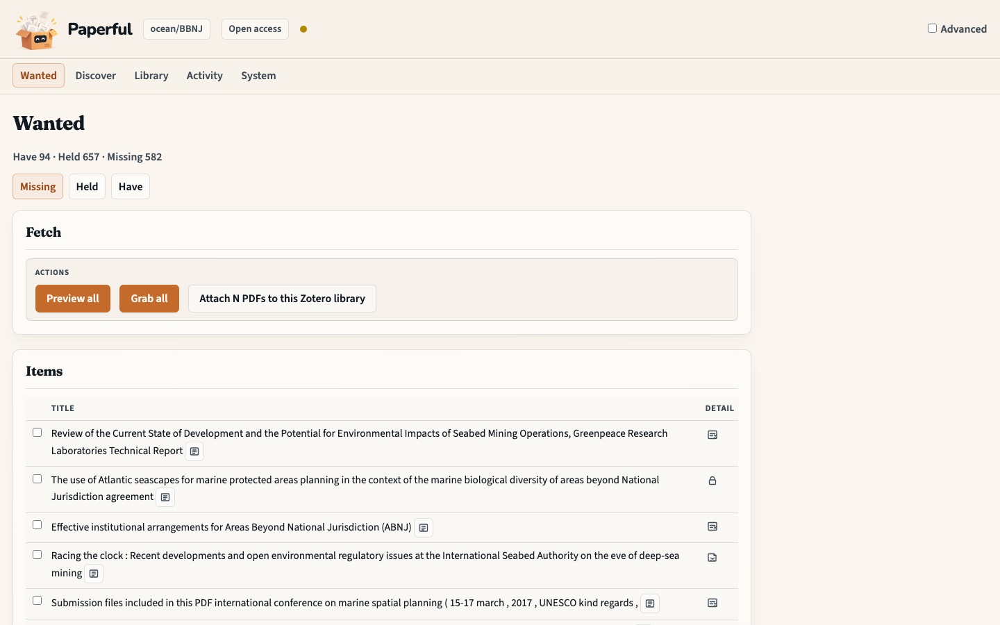
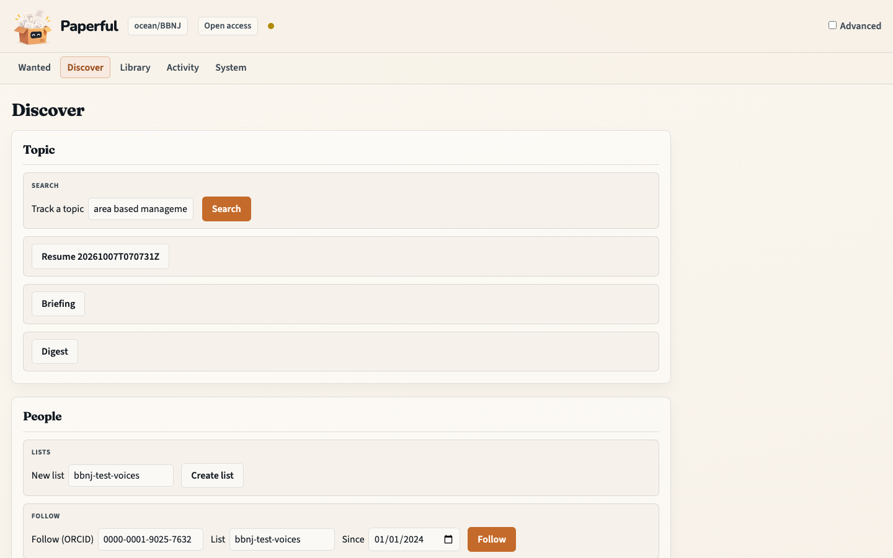
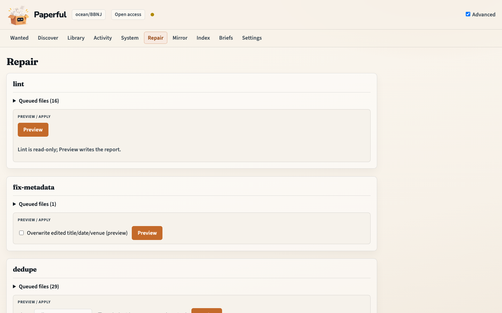
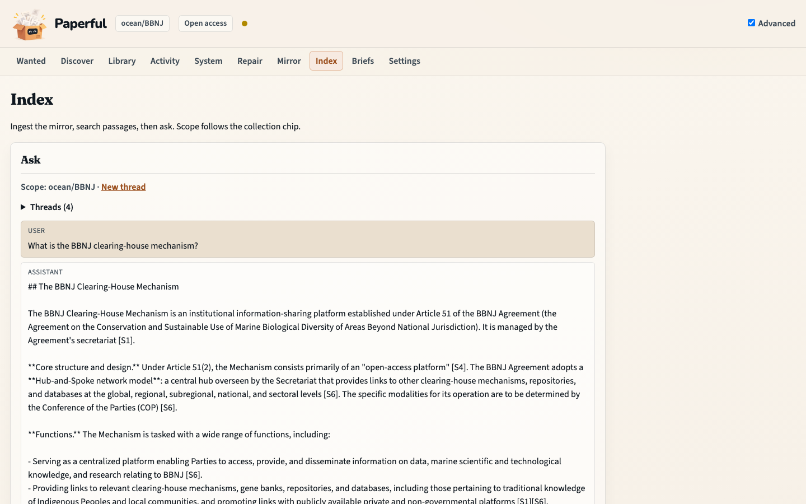

<h1 align="center">
  <picture>
    <source media="(prefers-color-scheme: dark)" srcset="website/images/logo-dark.png" />
    
  </picture>
</h1>

<p align="center">
  <a href="https://github.com/glen-w/Paperful/actions/workflows/ci.yml"></a>
  
  
  <a href="LICENSE"></a>
</p>

<p align="center">
  <strong>Find missing PDFs. Clean up your library. Keep control of your papers.</strong>
</p>

Paperful is a **local workbench** for a Zotero library you already keep.

Fill missing PDFs, tidy records, keep a folder copy on this machine. Open
access first; campus access when you have it. Not a sync client, not
Zotero-in-the-browser, not every paywalled PDF.

Zotero is well tested. Mendeley and EndNote are seeking testers.
[How it compares](docs/comparison.md).

## What can I do with it?

- See which items still need a PDF, preview a fetch, grab files onto `out/`, then attach the copies you trust
- Grow the library from a topic search or from people you follow (metadata first; PDFs after)
- Lint identifiers, review duplicates, and repair broken attachments
- Keep a folder mirror you can back up or hand to another tool
- Optionally ask the PDFs you already have (local model, off until you enable it)

Walkthroughs: [first fill](docs/first-fill.md), [grow the library](docs/grow-library.md),
[tidy a collection](docs/tidy-library.md). All of them: [Walkthroughs](docs/walkthroughs.md).

## Screenshots









## On your machine

Work lands on disk (`out/`, `state/`). Docker runs the workbench. Zotero and
headed `session login` stay on the host. Optional [Ollama](docs/llm.md) stays
off until you turn it on.

**Trust the disk** before notes or Ask:

1. Honesty — `gaps` / `attachments`
2. Grab — bytes under `out/`
3. You read `out/`
4. Then `summarize` / `ask`

**Attach** writes the PDF into Zotero. [Terms](docs/TERMS.md).

| Claim | Quote / proof |
| --- | --- |
| Stranger install is **Compose-first** | GitHub Actions job `docker` in [`.github/workflows/ci.yml`](.github/workflows/ci.yml): `docker compose build`, then `doctor --no-guide` with **no live Zotero**. Exit **2** is expected (Zotero row amber/red). |
| Dry-run shows the hit before the network | Wanted **Preview**, or `run --dry-run` **Would-hit**. `gaps` counts missing without fetching. |
| PDFs keep a source stamp | Provenance on the file (`paperful oa:unpaywall`, `campus:ezproxy`, `grey:undocs`) plus a readable parent line. |

## From a collection to PDFs on disk

1. `docker compose up` and open http://127.0.0.1:8765 (**Wanted**).
2. Set a collection on **Library** (target icon).
3. **Preview** → **Grab** (files land in `out/` only) → open `out/` yourself → **Attach**.

Full walkthrough: [First fill](docs/first-fill.md). How a fill searches:
[How it works](docs/how-it-works.md). The same verbs on the CLI for scripts
and one-shots.

## Quick start

Tagged **v0.9** means clone and **Compose build**. There is no GitHub Release
binary, no published image, and no PyPI package: do not `docker pull` or
`pip install paperful`.

**You need**

- [Docker](https://docs.docker.com/get-docker/) with Compose v2.
- Zotero **on the host** (not in Docker), local API enabled:
  Settings → Advanced → *Allow other applications on this computer to communicate with Zotero*.
- Zotero 10+ to attach PDFs. On Zotero 7–9 the tool still downloads to disk;
  attach later. [Zotero](docs/zotero.md).
- [uv](https://docs.astral.sh/uv/) on the host only when you log in a browser
  session (`uv run paperful session login ezproxy`). Operators do not need uv
  for `doctor` or the workbench. [Docker](docs/docker.md).
- A real `email` in config. Unpaywall is not called without it.

No campus access: **Open access** preset (`--preset oa`, or
`config.minimal.toml`). Campus EZProxy: **Campus** (`--preset eoi`) after
`ezproxy_base` is set. [Configuration](docs/config.md).

```sh
git clone https://github.com/glen-w/Paperful.git
cd Paperful
cp .env.example .env          # PAPERFUL_DATA=. keeps data in this checkout
                              # .env.example sets PAPERFUL_IMAGE_MODE=heavy
cp config.minimal.toml config.toml   # set email; full file is config.example.toml
docker compose build                 # heavy when set in .env; CI uses light
docker compose run --rm paperful doctor          # once; --guide for Enter walk
docker compose up                                # stays up; workbench at http://127.0.0.1:8765
```

First-run `doctor` without Zotero is **exit 2** (amber/red Zotero row) —
same as CI job `docker` (light). Layout: [Docker](docs/docker.md).

CLI one-shots (other terminal):

```sh
docker compose run --rm paperful collections
docker compose run --rm paperful run --collection interesting --preset oa --dry-run
```

Campus EZProxy: [ezproxy.md](docs/ezproxy.md), then `doctor --probe`.
Optional adapters (seeking testers): [Mendeley](docs/mendeley.md),
[EndNote](docs/endnote.md).

Site: [paperful.app](https://paperful.app/). Local preview:
`uv sync --extra docs && make pages-site`.

Reference:

- [Walkthroughs](docs/walkthroughs.md) — Wanted, Discover, Repair
- [Docker](docs/docker.md) — operator install; light/heavy packs
- [Workbench](docs/gui.md) — pages, Preview tokens, what stays CLI
- [Commands](docs/commands.md) · [Workflows](docs/workflows.md) · [Configuration](docs/config.md)
- [Source routing](docs/sources.md) · [Quiet mirror](docs/quiet-mirror.md)
- [Why Paperful](docs/why.md) · [Roadmap](docs/ROADMAP.md)

## Optional local LLM and Ask

Off until `[llm].enabled` / `[rag].enabled`. Needs a **heavy** Compose image
(or host `uv sync --extra llm --extra rag`). Grounded notes, collection
reviews, and Ask live on Advanced **Briefs** / **Index**.
[LLM](docs/llm.md) · [Ask your library](docs/rag.md).

```sh
ollama pull qwen2.5:7b                       # then set [llm] enabled = true
# Index Ask also needs: ollama pull nomic-embed-text and [rag] enabled = true
```

## Develop

Contributors use [uv](https://docs.astral.sh/uv/) (Python 3.10+). This is not
the operator install.

```sh
uv sync --group dev
cp config.example.toml config.toml
uv run paperful doctor
uv run pytest
```

Workbench screenshots: `.venv/bin/python scripts/docs/capture_workbench.py`
against a running `docker compose up`. See [CONTRIBUTING](CONTRIBUTING.md).

## License

[MIT](LICENSE)

---

<p align="center">
  <a href="https://ko-fi.com/C0C1XK8G" target="_blank" rel="noopener noreferrer"></a>
</p>
