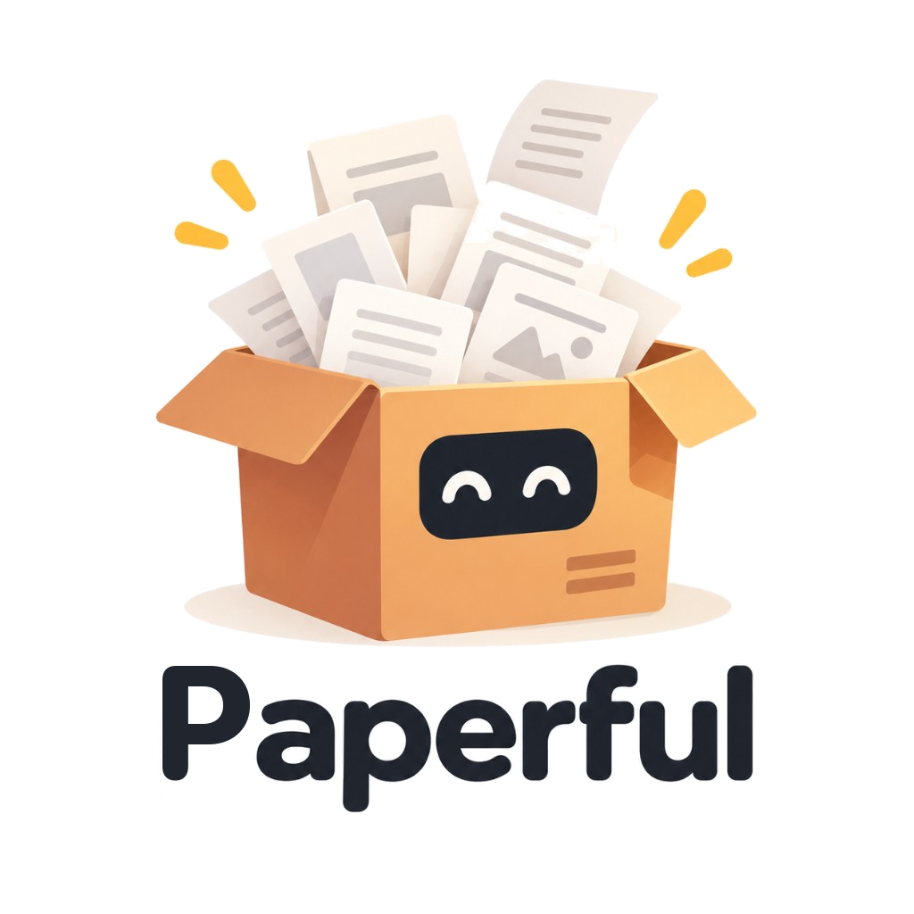

<h1 align="center">
  <picture>
    <source media="(prefers-color-scheme: dark)" srcset="website/images/logo-dark.png" />
    
  </picture>
</h1>

<p align="center">
  <a href="https://github.com/glen-w/Paperful/actions/workflows/ci.yml"></a>
  
  
  <a href="LICENSE"></a>
</p>

<p align="center">
  <strong>Find missing PDFs. Clean up your library. Keep control of your papers.</strong>
</p>

<p align="center">
  Local Compose CLI sidecar. Not a document-infra service, not a sync,
  mobile, or WebDAV client, not Zotero-in-the-browser.
  Not every paywalled or DOI-less item comes back.
  Zotero is the well-tested adapter. Mendeley and EndNote are seeking testers.
</p>

**Trust the disk** (do this order before summarize or Ask):

1. `gaps` — what is missing
2. `attachments` — ghosts, broken links, duplicate files (report only unless a surgery flag **and** `--apply`)
3. `run` — fill PDFs onto disk under `out/`
4. Open `out/` yourself
5. Then optional `summarize` / `ask`

`--link` is advanced attachment surgery, not the stranger path. Words:
[Terms](docs/TERMS.md) (`attach` ≠ TranscriptX `admit`; library = manager;
mirror = `out/`).

| Claim | Quote / proof |
| --- | --- |
| Stranger install is **Compose-first** | GitHub Actions job `docker` in [`.github/workflows/ci.yml`](.github/workflows/ci.yml): `docker compose build`, then `doctor --no-guide` with **no live Zotero**. Exit **2** is expected (Zotero row amber/red). Pytest-only is not Compose-first. `uv` is secondary (host session login and contributors). |
| Dry-run shows the hit before the network | `run --dry-run` **Would-hit** column; `gaps` counts missing without fetching. |
| PDFs keep a source stamp | Provenance on the file (`paperful oa:unpaywall`, `campus:ezproxy`, `grey:undocs`) plus a readable parent line. |

Five jobs: **library**, **find**, **completeness**, **mirror**, **control**.
The live catalogue is an adapter. Zotero’s local API is the one that is well
tested. Mendeley and EndNote are in the tree and seeking testers — do not
treat them as proven. Why this shape: [Why Paperful](docs/why.md). Not sure
this is the right tool? [How Paperful compares](docs/comparison.md).

**Library.** Collections, years, and item types are the scope. `import` and
`export` speak RIS, BibTeX, and EndNote XML. `ingest-dois` creates metadata
parents from a DOI list (dry-run unless `--apply`). See [Commands](docs/commands.md).

**Snowball grows. Run fills.** `snowball` proposes new works and creates
metadata parents only when the gate says so. `run` fetches PDFs for items
already in the library. Dry-run is the default for snowball; `run` attaches
on Zotero 10+ unless you pass `--dry-run`. `authorwatch` is people you
follow → their papers (no hop); see [Author watch](docs/authorwatch.md).
`snowball watch` re-runs a saved profile; `watch run --digest` writes the
frontier rollup. See [Snowball](docs/snowball.md)
and [Watch](docs/snowball.md#watch).

```sh
docker compose run --rm paperful snowball search "area based management" --gate dry-run
docker compose run --rm paperful run --collection interesting --preset oa --dry-run
```

**Find.** A fill (`run`) looks for a free copy first — Unpaywall, OpenAlex,
arXiv, bioRxiv/medRxiv, Europe PMC, Semantic Scholar, CORE, OpenAIRE, then
the item's own URL. Campus **EZProxy** when you have a subscription: log in
once in your browser; the password is not stored. The vault browser follows
the PDF link on the landing page. Hand-written or learned playbooks, then an
opt-in AI browser, take the landings those indexes miss
([sessions](docs/sessions.md)). **Google Scholar**
and **Sci-Hub** stay off until you opt in (Scholar needs a session login;
Sci-Hub occupies a legal grey zone in some jurisdictions — see
[Sci-Hub](docs/scihub.md)). Each item only hits sources that match its
metadata; `--try-all` disables that. If a site says slow down, the client
waits; if it keeps blocking, that source is paused so one publisher does not
stall the run. Sci-Hub coverage after ~2021 is thin — Paperful skips it for
items dated after 2021 (and drops it from the run when `--year-from` is past
that year). Recent paywalled papers are a campus-access problem when your
library has the subscription. Paperful does not fetch every paywalled or
DOI-less item. The PDF keeps a provenance stamp (`paperful oa:unpaywall`,
`campus:ezproxy`, `grey:undocs`). The parent item also gets a readable line
("Free copy from Unpaywall."), as a note unless `[remarks].surface` is `tag`
or `off`. One-page stubs and DOI mismatches can hold the file on disk until you
**attach** them (`attach --allow-short-pdf` / `--allow-pdf-doi-mismatch`) — see
[research-ops](docs/research-ops.md#wrong-work-pdfs). Drop-folder PDFs:
`inbox watch` / `drain` ([inbox](docs/commands.md)). Walkthrough:
[How it works](docs/how-it-works.md).

**Completeness.** `gaps` counts what is missing. `reachout` lists missing
PDFs for author contact (CSV / ResearchGate tabs) and never fetches or
sends mail. `refs gap` lists works
**cited inside** collection PDFs that are not in the library (always
dry-run; then `ingest-dois`). `lint` and `fix-metadata`
propose patches on disk; `--apply` writes them. `dedupe` reviews duplicates.
`--apply` writes "Same paper as Smith 2019, which already has the PDF." on
the spare copy, then merges that parent's PDF, notes, and better fields onto
the keeper. `attachments` reports broken links, ghosts, and duplicate PDFs
and does not change Zotero unless you pass a surgery flag with `--apply`.
`summarize` writes a grounded note
from a text-layer PDF; `synthesize` reviews those notes. `paperful all` runs
gaps → find → lint → fix → summarise. The model is off until `[llm].enabled`.
`paperful ocr --apply` adds a text layer to scanned PDFs on disk.

**Mirror.** Work happens **on disk** (`out/`, `state/`). Each command first
brings the mirror up to date with what changed in the library, then reads
the mirror: one folder per item (`record.json`, PDF, notes). With Zotero
closed, read commands carry on from it. `restore --apply`
recreates only what the live catalogue is missing and does not overwrite
fields already there. Copy `out/` yourself; Paperful is not a sync service.

**Control.** Downloads and proposals land on disk first. Write-back is a
separate step. Dry-run before a big fetch. Docker runs the tool; Zotero and
headed `session login` stay on the host. Python, the Zotero local API, Ollama
or LiteLLM.

Hosted site (GitHub Pages): landing in [`website/`](website/) plus Sphinx HTML
from this `docs/` tree at `/guide/`. Preview locally with
`uv sync --extra docs && make pages-site`, then open `_site/index.html`.
Live: [paperful.app](https://paperful.app/).

## Is this the right tool?

Yes, if you use Zotero, want an on-disk mirror, and will run a **CLI in Docker**.
Maybe, if Zotero’s own “find available PDF” already covers you.
**Today is CLI-first; 1.0 adds a workbench GUI** (run / review / apply the same
verbs, plus interactive Ask over your collection). Paperful is not
Zotero-in-the-browser, not a sync/mobile/WebDAV client, and not every paywalled
PDF. `paperful ocr` exists for scans on disk. Mendeley and EndNote are not
proven. Post-1.0: Firefox extension, local OpenAlex snapshot beyond opt-in v1,
newsletter ingest.
[Why](docs/why.md) · [Comparison](docs/comparison.md) · [GUI](docs/gui.md) · [Roadmap](docs/ROADMAP.md).

## Quick start

Tagged **v0.9** means clone and **Compose build**. There is no GitHub Release
binary, no published image, and no PyPI package: do not `docker pull` or
`pip install paperful`. Zotero and headed `session login` stay on the host.
Work lands on disk (`out/`, `state/`) inside `PAPERFUL_DATA` (Compose mounts
that host path at `/data`).

**You need**

- [Docker](https://docs.docker.com/get-docker/) with Compose v2.
- Zotero **on the host** (not in Docker), local API enabled:
  Settings → Advanced → *Allow other applications on this computer to communicate with Zotero*.
- Zotero 10+ to attach PDFs. On Zotero 7–9 the tool still downloads to disk;
  attach later with `paperful attach`. [Zotero](docs/zotero.md).
- [uv](https://docs.astral.sh/uv/) on the host only when you log in a browser
  session (`uv run paperful session login ezproxy`). Operators do not need uv
  for `doctor` or `run`. [Docker](docs/docker.md).
- A real `email` in config. Unpaywall is not called without it. `doctor` exits
  2 on that row when Unpaywall is in `sources`.

No campus EZProxy: use `--preset oa` (or `config.minimal.toml`). The default
source list includes `ezproxy`, which is skipped until `ezproxy_base` is set.
`--preset eoi` is open access plus EZProxy, no Scholar, no Sci-Hub — the same
list as the default today. [Configuration](docs/config.md).

```sh
git clone https://github.com/glen-w/Paperful.git
cd Paperful
cp .env.example .env          # PAPERFUL_DATA=. keeps data in this checkout
cp config.minimal.toml config.toml   # set email; full file is config.example.toml
docker compose build
docker compose run --rm paperful doctor          # TTY guide when stdin is a TTY
docker compose run --rm paperful collections
docker compose run --rm paperful run --collection interesting --preset oa --dry-run

# campus EZProxy in the source list (skipped until ezproxy_base is set)
docker compose run --rm paperful run --collection interesting --preset eoi --dry-run
```

Layout and the host/container split: [Docker](docs/docker.md)
(`PAPERFUL_DATA` → `/data`; `out/` and `state/` live **inside** that mount).
First-run `doctor` without Zotero is **exit 2** (amber/red Zotero row) — same
as CI job `docker`.

Optional (seeking testers): Mendeley via REST — register an app, then
`paperful session login mendeley` on the host. [Mendeley](docs/mendeley.md).
EndNote desktop — set `[endnote].library` to the `.enl`. Writes are an import
bundle. [EndNote](docs/endnote.md).

If you use campus EZProxy, finish [Campus EZProxy](docs/ezproxy.md) and confirm
with `paperful doctor --probe` before a big run. If you keep `scholar` in
`sources`, log in once on the host with `paperful session login scholar` — see
[Browser sessions](docs/sessions.md).

Flags `--year-from` / `--year-to` and `--type` / `-T` also work on `lint`,
`fix-metadata`, `dedupe`, `attachments`, `gaps`, `reachout`, `summarize`, `synthesize`, `snapshot`, and
`restore`. Save them with `paperful profile save`. See
[Commands](docs/commands.md) and [Workflows](docs/workflows.md).

```sh
docker compose run --rm paperful run -C BBNJ --year-from 2023 --year-to 2026 -T journalArticle
docker compose run --rm paperful all -C BBNJ --year-from 2021 --year-to 2026 -T journalArticle
docker compose run --rm paperful all --profile bbnj-journal
```

Reference (same corpus as the hosted guide):

- [Docker](docs/docker.md) — preferred operator install; Zotero stays on the host
- [Commands and output](docs/commands.md)
- [Configuration](docs/config.md)
- [Source routing](docs/sources.md)
- [Architecture](docs/architecture.md)
- [Quiet mirror](docs/quiet-mirror.md) — `out/` as a browsable collection tree
- [Duplicate packs](docs/dedupe.md)
- [Research operators](docs/research-ops.md) — email, campus use, provenance

Optional local LLM (Ollama by default; off until `[llm].enabled`): grounded
title proposals in `fix-metadata`, a `pdf_identity_mismatch` lint check,
`summarize` (HTML under `state/summaries/` and a tagged Zotero child note;
`--to disk` skips the note), `synthesize` (a literature review of those
notes), and `recover`: last `run` lane after Scholar / EZProxy / htmlpdf
fail, or `paperful recover --item` for named keys. Override the auto lane
per run with `--browser-agent` / `--no-browser-agent`. Setup, model guidance,
privacy notes, and troubleshooting:
[LLM](docs/llm.md); key table:
[Configuration](docs/config.md#llm-optional-local-first).

```sh
ollama pull qwen2.5:7b                       # then set [llm] enabled = true in config.toml
uv run paperful doctor                       # LLM row must be green
uv run paperful summarize --item ITEMKEY     # disk HTML + tagged child note
uv run paperful synthesize -C COLLECTION     # report from those notes
```

Optional library index (off until `[rag].enabled`): `paperful rag ingest`
indexes the PDFs and abstracts in the mirror, and `paperful ask` answers
questions from it with cited papers and pages. It reads `out/` only and never
calls the reference manager. Setup: [Ask your library](docs/rag.md).

```sh
uv sync --extra rag && ollama pull nomic-embed-text   # then set [rag] enabled = true
uv run paperful rag ingest -C COLLECTION     # scans get OCR; text PDFs do not
uv run paperful ask "What do these papers say about X?" -C COLLECTION
uv run paperful ask --thread new "…" -C COLLECTION   # follow-ups rewrite retrieval
```

## Develop

Contributors use [uv](https://docs.astral.sh/uv/) (Python 3.10+). This is not
the operator install.

```sh
uv sync --group dev
cp config.example.toml config.toml
uv run paperful doctor
uv run pytest
```

Playwright ships with `uv sync`; Chromium installs on the first host
`paperful session login`. Optional LLM extras: [LLM](docs/llm.md).

See [CONTRIBUTING](CONTRIBUTING.md).

## License

[MIT](LICENSE)

---

<p align="center">
  <a href="https://ko-fi.com/C0C1XK8G" target="_blank" rel="noopener noreferrer"></a>
</p>
