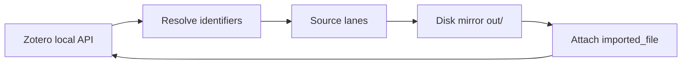

# Paperful architecture

Paperful is a **local CLI** that fills missing PDFs in a Zotero library. Zotero remains the system of record; Paperful reads items via the local API (`localhost:23119`), downloads PDFs to a collection-shaped folder tree, and optionally attaches them back through the Zotero 10+ write API.

## Data flow

1. **Scope** — collection subtree or whole library; skip items that already have an imported PDF (and by default skip items with only a `linked_url` PDF).
2. **Resolve** — enrich DOI from Crossref / OpenAlex / Semantic Scholar when missing.
3. **Sources** — ordered list (Unpaywall, OpenAlex, arXiv, …, EZProxy, HTML→PDF); per-item routing skips inapplicable sources unless `--try-all`.
4. **Download** — validate PDF size; write under `out_dir` mirroring collection paths; append to `state/manifest.jsonl`.
5. **Attach** — optional `imported_file` upload via local write API; failures recorded as `attach_failed` with typed reasons.

## Circuit breaker

Open-access sources run in parallel (`concurrency_oa`). Block-like outcomes (CAPTCHA, 429, “sorry”, …) increment a per-source counter; after `circuit_breaker_threshold` the source is skipped for the rest of the run. Sci-Hub, EZProxy, and HTML→PDF stay serial.

## Sci-Hub and presets

Sci-Hub is **never** in the default source list; opt in via config, `--scihub`, or `--sources`. The `eoi` preset (`--preset eoi`) limits runs to open access plus campus EZProxy (no Scholar, no Sci-Hub).

## Disk mirror vs cloud quota

When Zotero cloud storage is full, attachments may fail with quota errors; PDFs still land on disk and can be attached later. Linked PDF URLs in Zotero are treated as “already covered” unless `--upgrade-linked` is set.

## Operator tooling

- `paperful doctor` — preflight (Zotero, writable dirs, email, cookies).
- `paperful report --json` — manifest counts and attach-failure breakdown for automation (`state/last-run.json` carries the latest run summary including linked-URL skips).

## Grey literature limits

Items without a DOI (and without a usable arXiv id or direct URL) stop at `no_identifier`. UN and process documents (PrepCom, DOALOS, undocs) often lack DOIs Unpaywall can resolve — use `direct` / `htmlpdf` when a stable URL exists, or add metadata in Zotero first.
