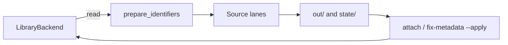

# Paperful architecture

Paperful is a **local CLI**. Fetch, identifier checks, and proposed metadata
patches happen **on disk** (`out/`, `state/`). A **library adapter** reads the
catalogue and, separately, writes PDFs or field patches back. Zotero (local API
on `localhost:23119`) is the first adapter; `manager = "mendeley"` is reserved.

`run` never rewrites bibliographic fields. Attach and `fix-metadata --apply`
use the Zotero 10+ write API.

## Data flow

1. **Scope** — collection subtree or whole library; `run` skips items that already have an imported PDF (and by default skip items with only a `linked_url` PDF).
2. **Prepare identifiers** — verify library DOI; optional in-memory swap; PubMed PMID→DOI; title→DOI via Crossref / OpenAlex / Semantic Scholar. Skipped for web/blog/forum types.
3. **Sources** — ordered list (Unpaywall, OpenAlex, arXiv, …, CORE, EZProxy, HTML→PDF); per-item routing skips inapplicable sources unless `--try-all`.
4. **Download** — validate PDF size; write under `out_dir`; extract PDF DOI (`pdftotext`, then `pypdf`); append to `state/manifest.jsonl`.
5. **Attach** — optional `imported_file` upload via local write API; failures recorded as `attach_failed` with typed reasons.

`paperful lint` runs step 2 (and PDF-text DOI) for items **with and without** PDFs. `paperful fix-metadata` writes `state/metadata-patches.jsonl` then, with `--apply`, pushes patches through the adapter.

## Disk artifacts

| Path | Role |
| --- | --- |
| `out/<collection>/…pdf` | Collection-mirrored downloads |
| `state/manifest.jsonl` | Append-only resume ledger. Latest line per item key wins. Fields include `doi` (used this attempt), `library_doi`, `doi_verified`, `pdf_doi` |
| `state/metadata-patches.jsonl` | Proposed patches (`doi`, `title`, `date`, `publicationTitle`) |
| `state/pdf-cache/` | Manager PDFs exported so lint reads text on disk |
| `state/sessions/` | Chromium profile + `meta.json` (login timestamps, no secrets). Netscape dumps for httpx |
| `state/last-run.json` | Latest `run` report (`paperful.run_report.v1`) |
| `state/runs/<stamp>-<command>.json` | Historical `run` and `fix-metadata` reports |

`doi_verified` is `ok` (≥ `crossref_min_score`), `suspect` (< `doi_suspect_score`), `swapped` (in-memory replacement), `unknown` (API down, mid-range match, or `verify_doi = false`), or `missing`. `unknown` never swaps.

## Library adapter

[`paperful/library.py`](../paperful/library.py) defines `LibraryBackend`: list items, export a PDF **onto disk**, apply a field patch, attach a file. Identifier logic (`resolve`, `lint`, `pdfid`, `metadata`) must not import Zotero except through this protocol.

## Identifiers and lint

[`paperful/resolve.py`](../paperful/resolve.py) `prepare_identifiers` is shared by `run` and `lint`. Swap is in memory only. PubMed uses NCBI ID Converter on `PMID:` / `PubMed PMID:` in Extra.

[`paperful/lint.py`](../paperful/lint.py) finding codes (manager-agnostic “library DOI”):

| Code | When |
| --- | --- |
| `missing_doi` | Scholarly type, no DOI after prepare |
| `suspect_doi` | Library DOI fails title check, no swap candidate |
| `swappable_doi` | High-confidence replacement ≠ library DOI |
| `pmid_no_doi` | PMID present, converter failed |
| `pdf_doi_mismatch` | PDF-text DOI ≠ library DOI and ≠ prepared DOI |
| `no_identifier` | No DOI, arXiv id, PMID, or URL |

`--json` prints only findings. Exit 0 unless `--strict`. Lint prefers a file already on disk (`item.pdf_path` or manifest `path`) and calls `export_pdf` only when `has_pdf` and nothing is on disk.

[`paperful/metadata.py`](../paperful/metadata.py) whitelist: `doi`, `title`, `date`, `publicationTitle`. Default fills empty venue/date; `--overwrite` may replace title/date/venue. Never invents creators.

## PDF text

[`paperful/pdfid.py`](../paperful/pdfid.py): `pdftotext` (Poppler) if on `PATH`, else `pypdf` (first two pages + `/Title`). Manager fulltext is last-resort: export the file to `state/pdf-cache/` first. `paperful doctor` reports amber if `pdftotext` is missing.

## Circuit breaker

Open-access sources run in parallel (`concurrency_oa`). Block-like outcomes (CAPTCHA, 429, “sorry”, …) increment a per-source counter; after `circuit_breaker_threshold` the source is skipped for the rest of the run. Scholar, Sci-Hub, EZProxy, and HTML→PDF stay serial (Scholar/htmlpdf share one Chromium profile lock).

## Sci-Hub and presets

Sci-Hub is **never** in the default source list; opt in via config, `--scihub`, or `--sources`. The `eoi` preset (`--preset eoi`) limits runs to open access plus campus EZProxy (no Scholar, no Sci-Hub). CORE is in the default list but skipped until `core_api_key` is set.

## Disk mirror vs cloud quota

When Zotero cloud storage is full, attachments may fail with quota errors; PDFs still land on disk and can be attached later. Linked PDF URLs in Zotero are treated as “already covered” unless `--upgrade-linked` is set.

## Operator tooling

- `paperful doctor` — preflight (Zotero, writable dirs, email, sessions, pdftotext).
- `paperful lint` / `paperful fix-metadata` — identifier hygiene; apply is explicit.
- `paperful report` / `paperful report --last-run` — manifest totals plus the latest
  auditable run report (`state/last-run.json`, history under `state/runs/`).
  Each `run` ends with a summary: PDFs downloaded, in-memory field corrections,
  sources checked, and typed errors.

## Grey literature

`direct` rewrites known landings to PDFs (PMC, arXiv, HAL, FAO, **undocs / daccess / documents.un.org**). A UN document symbol in Extra or title (`A/CONF.232/2023/4`, `A/AC.292/…`) is enough to synthesize an undocs PDF URL when the item has no URL. ISA and `un.org` landings pick up `.pdf` / download links. DOI-less `report` items can fall through to `htmlpdf`. Campus EZProxy is never used for these public hosts.

Items with no DOI, arXiv id, PMID, URL, or UN symbol still stop at `no_identifier`.

## Related docs

- [ROADMAP.md](ROADMAP.md) — core vs maybe-later workbench; optional local/LiteLLM title assist
- [comparison.md](comparison.md) — where paperful sits next to plugins and bib tools
- [README](../README.md) — commands, configuration, session vault, EZProxy
