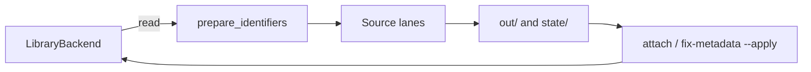

# Paperful architecture

Paperful does five jobs — **library**, **find**, **completeness**,
**mirror**, **control** — as a **local CLI**. Fetch, identifier checks,
proposed metadata patches, summaries, and the per-item mirror happen **on
disk** (`out/`, `state/`). A **library adapter** reads the catalogue and,
separately, writes PDFs or field patches back. **Zotero** (local API on
`localhost:23119`) is the well-tested adapter. `manager = "mendeley"` talks
to the Mendeley REST API; `manager = "endnote"` reads a local `.enl` library
and stages an XML import bundle instead of editing the database. Both are
**seeking testers** — do not treat them as proven. The disk mirror is what
you keep if the manager changes. See [Why Paperful](why.md).

`run` never rewrites bibliographic fields. On Zotero, attach,
`fix-metadata --apply`, and `dedupe --apply` use the Zotero 10+ write API.
Dedupe merges the extra parent's PDF, notes, and better fields onto the keeper, then moves that parent to the Zotero trash. It does not delete files under `out/`.

(mirror-first)=
## Mirror first

Reference managers are flaky. A local API stalls, item keys change after a
sync, an attachment row outlives its bytes. Paperful's answer is to copy the
user's files and metadata into its own mirror (`out/`, `state/`) and work
from that copy. The manager API is a narrow door with three uses:

1. **Refresh the mirror.** Read catalogue rows, notes, and PDF bytes, and
   write them under `out/`.
2. **Write back when asked.** Attach a PDF, apply a patch, merge a duplicate,
   post a note. Always explicit, and the result is on disk first.
3. **Check the door.** `ping`, write support, authorize.

Anything else is a call Paperful should not be making. Rules for new code:

- A verb that only reads takes its items, PDFs, and notes from the mirror. A
  live listing is for refreshing the mirror, not for doing the work.
- A manager that is not running costs write-back. It does not cost the read
  work.
- A write to the manager also updates `record.json`, so the mirror does not
  wait for the next `snapshot` to be true.
- A failed read is an error. It is never recorded as "no children" or "no
  PDF".
- Bytes exported from the manager go into the item folder, not a side cache.
- pyzotero is called only from `zot.py`, `library.py`, and `attach.py`. A new
  `LibraryBackend` method needs a reason the mirror cannot serve.

How the code does it:

- **Refresh.** A command first asks Zotero what changed since the library
  version in `out/_sync.json`, rewrites those items' folders, marks items
  that left, and then records the new version
  ([`sync.py`](../paperful/sync.py)). Six requests when nothing changed. A
  first refresh reads the whole library once. A read that fails stops the
  refresh before the version moves.
- **Read.** The command then reads `out/`
  ([`catalogue.py`](../paperful/catalogue.py)): collections, items, child
  notes, attachment rows, PDFs. With Zotero closed it reads the mirror as it
  is and says how old it is. `--offline` (or `PAPERFUL_OFFLINE=1`) never
  contacts the manager.
- **Write through.** A write goes to the manager; that item is then re-read
  into its folder in the same step (`MirroredBackend` in
  [`library.py`](../paperful/library.py)). A trashed or merged parent is
  marked in its record. Nothing under `out/` is deleted.

Four verbs talk to the manager directly, because comparing it with the
mirror is their job: `sync`, `snapshot`, `restore`, and `attachments`. They
exit 2 when it is down. So does any `--apply`, attach, or note write.

Mendeley and EndNote have no change feed. Their reads stay with the manager,
as before; the write-through still applies.

## Data flow

```mermaid
flowchart LR
  adapter[LibraryBackend]
  resolve[prepare_identifiers]
  sources[Source lanes]
  disk[out/ and state/]
  writeback[attach / fix-metadata --apply]
  adapter -->|read| resolve --> sources --> disk --> writeback --> adapter
```

0. **Refresh** — bring `out/` up to the manager's current library version
   (skipped offline, or with `[mirror].refresh = "manual"`).
1. **Scope** — read from the mirror: collection subtree or whole library; optional `--year-from` /
   `--year-to` (inclusive; undated items dropped) and `--type` / `-T` (Zotero
   item types); `run` skips items that already have an imported PDF (and by
   default skip items with only a `linked_url` PDF).
2. **Prepare identifiers** — verify library DOI; optional in-memory swap; PubMed PMID→DOI; title→DOI via Crossref / OpenAlex / Semantic Scholar. Skipped for web/blog/forum types.
3. **Sources** — ordered list (Unpaywall, OpenAlex, arXiv, …, CORE, EZProxy, HTML→PDF); per-item routing skips inapplicable sources unless `--try-all`.
4. **Download** — validate PDF magic and `min_pdf_bytes`; probe page count and
   first-page word density (`pdfid`); write under `out_dir` inside
   `<Author - Year - Title -- KEY>/`; write or refresh `record.json`; extract PDF DOI (`pdftotext`, then `pypdf`); append to `state/manifest.jsonl`.
   Sparse one-pagers soft-reject so later sources can still run; denser one-pagers
   stay `ok` with `reason=short_pdf` until `attach --allow-short-pdf`.
5. **Attach** — optional write-back through the adapter (Zotero `imported_file`
   upload; Mendeley `POST /files`; EndNote stages a bundle until `flush_writes`).
   Failures recorded as `attach_failed` with typed reasons. Batch `attach` skips
   `reason=strict_pdf_doi` and `reason=short_pdf` unless the matching allow flag
   is passed.

`paperful lint` runs step 2 (and PDF-text DOI) for items **with and without** PDFs. `paperful fix-metadata` writes `state/metadata-patches.jsonl` then, with `--apply`, pushes patches through the adapter.

## Disk artifacts

| Path | Role |
| --- | --- |
| `out/<collection>/<stem -- KEY>/` | Per-item restore folder |
| `out/<collection>/<stem -- KEY>/record.json` | `paperful.item.v1`. Catalogue fields plus fetch provenance. 0.x may add keys |
| `out/<collection>/<stem -- KEY>/*.pdf` | PDF when `run` downloaded it, or when `snapshot --pdfs all` exported it |
| `out/<collection>/<stem -- KEY>/notes/` | Child-note HTML, including a copied summary when one exists |
| `out/<collection>/<stem -- KEY>/annotations.json` | The reader's highlights and notes on the item's attachments, as the manager holds them (`paperful.annotations.v1`). Written by a refresh; absent when there are none |
| `out/_sync.json` | The library version the mirror was last refreshed to, when, and whether every manager PDF has been copied (`paperful.sync.v1`) |
| `out/_trash/` | Folders of items that left the library, when `[mirror].gone = "trash"`. Default is to keep the folder in place and mark the record |
| `out/_index.jsonl` | Lookup rollup: item key, dirs, has_pdf, md5, child keys, and `state` for an item that left. Later lines win; a refresh rewrites it compact |
| `out/_collections.json` | Collection tree (`paperful.collections.v1`) |
| `out/_history.json` | Pointers at `state/` ledgers. Not a copy of sessions or keys |
| `state/manifest.jsonl` | Append-only resume ledger. Latest line per item key wins. Fields include `doi` (used this attempt), `library_doi`, `doi_verified`, `pdf_doi` |
| `state/metadata-patches.jsonl` | Proposed patches (`doi`, `title`, `date`, `publicationTitle`) |
| `state/dedupe-packs/` | Duplicate review packs from `dedupe` (JSON + Markdown) |
| `state/dedupe-applied.jsonl` | Merge audit; appended only on `dedupe --apply` |
| `state/cites/<hash>.json` | OpenAlex reference lists for one DOI set, inverted so snowball can say how many items in the target collection cite a new work. Reused until that DOI set changes |
| `state/version-packs/` | Preprint/published review packs (`paperful.version_pack.v1`) |
| `state/versions-applied.jsonl` | One line per work updated by `versions --apply` |
| `state/refs-gaps/<stamp>/` | `refs gap` review pack (`paperful.refs_gap.pack.v1`, `pack.md`, `dois.txt`). Always dry-run |
| `state/ingest/<stamp>/` | `ingest-dois` summary (`paperful.ingest_dois.v1`). Dry-run unless `--apply` |
| `state/inbox/proposals/` | Gated inbox create/attach proposals (`paperful.inbox.proposal.v1`) |
| `state/pdf-cache/` | Throwaway copies of manager PDFs, only when `[mirror].pdfs = "none"`. Otherwise an exported PDF goes into its item folder, and `sync` moves older cache files there |
| `state/summaries/<key>.html` | `summarize` output when dest includes disk; the Zotero child note is the other copy |
| `state/reports/<slug>.html` | `synthesize` literature review; sibling `<slug>.json` records source hashes |
| `state/sessions/` | Chromium profile + `meta.json` (login timestamps, no secrets). Netscape dumps for httpx |
| `state/fetch-wins.jsonl` | One line per vault or browser-agent PDF (host and path; query string dropped). Input to `paperful playbooks propose` |
| `state/playbooks-proposed.toml` | Draft learned pack from `playbooks propose`. Not loaded until `playbooks promote` |
| `state/last-run.json` | Latest `run` or `recover` report (`paperful.run_report.v1`). Other verbs do not replace it |
| `state/runs/<stamp>-<command>.json` | One report per `run`, `recover`, `gaps`, `lint`, `fix-metadata` (dry-run and `--apply`), `attachments` (dry-run and `--apply`), `summarize`, `synthesize`, and `snapshot` |
| `state/packs/<id>.json` | Parent witness (`paperful.pack.v1`) listing those reports for one `pack open` … `pack close` sequence. `state/packs/current` names the open id |
| `state/mendeley-oauth.json` | Mendeley tokens after `session login mendeley` (mode `0600`) |
| `state/endnote-import/<stamp>/` | EndNote XML+PDF bundle for File → Import. Never an edit of `.enl` |

`doi_verified` is `ok` (≥ `crossref_min_score`), `suspect` (< `doi_suspect_score`), `swapped` (in-memory replacement), `unknown` (API down, mid-range match, or `verify_doi = false`), or `missing`. `unknown` never swaps.

## Library adapter

Commands hold a `MirrorFirstBackend`: the same protocol, with reads served
from `out/` and writes passed to the manager adapter. The adapter itself is
below.

[`paperful/library.py`](../paperful/library.py) defines `LibraryBackend`: report what changed since a library version (`changes`, Zotero only), list items, fetch one item by key (`get_item`), export a PDF **onto disk**, apply a field patch, merge a duplicate parent (children and better fields, then trash), trash a **note** (`trash_note` — never a parent), attach a file, create-or-update a **tagged child note** (`create_or_update_note`, used by `summarize`), create-or-update a **standalone collection note** (`create_or_update_collection_note`, used by `synthesize`), and `flush_writes()` (EndNote stages `state/endnote-import/<stamp>/`; others no-op). The tag makes re-runs update instead of duplicate. Identifier and dedupe logic (`resolve`, `lint`, `pdfid`, `metadata`, `dedupe`, `identity`) must not import a manager except through this protocol. [`paperful/identity.py`](../paperful/identity.py) is the shared DOI then title+year fingerprint used by snowball, `refs gap`, `ingest-dois`, and inbox title-match. [`paperful/refs_gap.py`](../paperful/refs_gap.py) and [`paperful/ingest_dois.py`](../paperful/ingest_dois.py) create review packs / parents through the adapter; they do not fetch PDFs. [`paperful/inbox_match.py`](../paperful/inbox_match.py) is the drop-folder match ladder. Notes are skipped by `items_in_scope`, so a report note never enters `run` / `lint` / `gaps`. Canonical item types are Zotero ids; [`paperful/interop/`](../paperful/interop/) maps RIS / BibTeX / EndNote XML at the edge. `paperful import` / `export` use that layer. **Zotero is well tested.** [Mendeley](mendeley.md) and [EndNote](endnote.md) are seeking testers.

## LLM layer (optional, local-first)

[`paperful/llm/`](../paperful/llm/) is a thin transport: `OllamaClient` (httpx to a loopback daemon by default), `LiteLLMClient` (import-gated behind `paperful[llm]`, keys from env), `NullLLMClient` when `[llm].enabled = false`. Verbs import only `paperful.llm`; `validate.py` / `preflight.py` fail before any network call. [`paperful/grounding.py`](../paperful/grounding.py) supplies PDF text disk-first (`out/`, then `state/pdf-cache/` via `export_pdf`) and a head+headings+tail budget slice.

| Verb | Gate | Output | Library write |
| --- | --- | --- | --- |
| `run` (`browser_agent`) / `recover --item` | `llm.enabled` + `paperful[browser-agent]` (Py 3.11+) | PDF in `out/`, manifest `source=browser_agent` | existing attach |
| `fix-metadata` title proposals | `[fix_metadata].llm_title` | `Patch(source="llm_title")` | `--apply` |
| `lint` identity check | `[lint].llm_pdf_match` | finding `pdf_identity_mismatch` | none |
| `summarize` | `llm.enabled` | `state/summaries/<key>.html` when dest includes disk | child note unless `--to disk` |
| `synthesize` | `llm.enabled` | `state/reports/<slug>.html` when dest includes disk | standalone note in the scoped collection unless `--to disk` |

`browser_agent` is a registered **serial** source but never in `DEFAULT_SOURCES`. `run` auto-appends it when `[llm].enabled` and `[browser_agent].during_run` (default on) and the extra is importable. Default `[fetch].order = "policy"` places Scholar (if opted in) immediately before the agent, **interleaved** per item so a Scholar hit skips the agent; `[fetch].order = "list"` inserts the agent after the last of scholar / ezproxy / htmlpdf as before. The agent runs only if one of those vault lanes was tried and failed. `--browser-agent` / `--no-browser-agent` on `run` or `all` override `during_run` for that invocation. Before that phase the pipeline closes `BrowserSession` so browser-use can own the vault Chromium profile. Opt-in **SerpApi** (`[serpapi].enabled`, env `SERPAPI_API_KEY`) is a later serial Scholar-engine search; `[serpapi].max_calls` / `--serpapi-max` cap paid calls (see [SerpApi](serpapi.md)). `paperful recover --item` builds the pipeline with `use_browser=False` and only that source. Hard CAPTCHAs end as `captcha`, not auto-solved. `summarize` refuses items the gated identity check flags unless `--force`.

## Identifiers and lint

[`paperful/resolve.py`](../paperful/resolve.py) `prepare_identifiers` is shared by `run` and `lint`. Swap is in memory only. PubMed uses NCBI ID Converter on `PMID:` / `PubMed PMID:` in Extra.

[`paperful/lint.py`](../paperful/lint.py) finding codes (manager-agnostic “library DOI”):

| Code | When |
| --- | --- |
| `missing_doi` | Scholarly type, no DOI after prepare |
| `suspect_doi` | Library DOI fails title check, no swap candidate |
| `swappable_doi` | High-confidence replacement ≠ library DOI |
| `pmid_no_doi` | PMID present, converter failed |
| `pdf_doi_mismatch` | PDF-text DOI ≠ library DOI and ≠ prepared DOI |
| `title_html` | Scholarly title contains HTML tags or entities |
| `title_all_caps` | Scholarly title is mostly ALL CAPS (`fix-metadata` recases to Title Case; `state/acronyms/` tokens stay uppercase) |
| `title_filename` | Scholarly title looks like a filename or path (finding only) |
| `title_unusable` | Scholarly title is blank or a citation string, not the work title |
| `no_identifier` | No DOI, arXiv id, PMID, or URL |
| `pdf_identity_mismatch` | Opt-in LLM says first pages do not match the record (or low confidence) |

`--json` prints only findings. Exit 0 unless `--strict`. Lint prefers a file already on disk (`item.pdf_path` or manifest `path`) and calls `export_pdf` only when `has_pdf` and nothing is on disk.

[`paperful/metadata.py`](../paperful/metadata.py) whitelist: `doi`, `title`, `date`, `publicationTitle`. Default fills empty venue/date (richest Crossref/OpenAlex date available) and replaces a blank or citation-shaped title from the DOI work. `--overwrite` may replace title/date/venue when the candidate is at least as precise. Verified `pdf_doi_mismatch` can propose a DOI (`source=pdf`). HTML markup in titles is stripped into a title patch; ALL CAPS titles are recased to Title Case (`source=title_case`); tokens in `state/acronyms/` stay uppercase; filename titles stay lint-only. The same ALL CAPS → Title Case pass runs when creating parents (`parent_payload` / snowball ingest) and when a DOI work title is written by `fix-metadata`, so new items do not land ALL CAPS in Zotero. Never invents creators. `state/metadata-patches.jsonl` is an append-only audit log (one patch per item key per invocation); not a curated re-apply queue.

## PDF text

[`paperful/pdfid.py`](../paperful/pdfid.py): `pdftotext` (Poppler) if on `PATH`, else `pypdf` (first two pages + `/Title`; `max_pages=None` reads the whole file for `summarize`). Also `page_count`, first-page `word_count`, and `short_pdf_verdict` for the one-page density gate on `run` (and sparse reject on handoff ingest). Manager fulltext is last-resort: export the file to `state/pdf-cache/` first. `paperful doctor` reports amber if `pdftotext` is missing.

[`paperful/ocr.py`](../paperful/ocr.py): `paperful ocr` (dry-run unless `--apply`) runs `ocrmypdf` on image PDFs and replaces the file under `out/`. A manager-only PDF is exported into the item folder first; `state/pdf-cache/` is never the file that gets the layer, because the next export would overwrite it. `--attach` uploads that file as a new attachment and leaves the scan in place. `doctor` is amber when `ocrmypdf` is missing. The step is optional on `paperful all` (`--steps`), not in the default chain.

## Circuit breaker

Open-access sources run in parallel (`concurrency_oa`). Captcha and block pages increment a per-source counter; after `circuit_breaker_threshold` the source pauses, then one later item is probed. A 429 does not open the circuit. Scholar, Sci-Hub, EZProxy, and HTML→PDF stay serial (they share one Chromium profile lock). `run` probes EZProxy before batch 1 when configured. An expired session skips further proxy wraps; on a TTY, `run` offers re-login at the next batch boundary and again after the fetch (`ezproxy_relogin`, default on) to retry session-expired items. Publisher PDF URLs that 403 on httpx are retried in that profile (EZProxy-wrapped when configured). Direct PDF URLs are tried before landing pages.

## Sci-Hub and presets

Sci-Hub is **never** in the default source list; opt in via config, `--scihub`, or `--sources`. `--preset oa` drops EZProxy. `--preset eoi` is open access plus campus EZProxy (no Scholar, no Sci-Hub), which matches the default list today. CORE is in the default list but skipped until `core_api_key` is set.

## Disk mirror vs cloud quota

When Zotero cloud storage is full, attachments may fail with quota errors; PDFs still land on disk and can be attached later. Linked PDF URLs in Zotero are treated as “already covered” unless `--upgrade-linked` is set.

**Quiet mirror:** `out/<collection>/<stem -- KEY>/` is a browsable restore
folder (dual store with Zotero `storage/` after `imported_file` attach).
`sync` keeps a folder for every item. `[mirror].pdfs` chooses whether
existing Zotero PDFs are copied in (`all`, the default), copied the first
time a command needs one (`lazy`), or kept out (`none`). `paperful restore --apply`
creates missing items from those folders and does not overwrite fields that
are already in Zotero. Stance: [quiet-mirror.md](quiet-mirror.md). House
folder sync is out of scope for this CLI.

## Ghost attachments

Zotero can show **The attached file could not be found** for a path under the data directory’s `storage/<key>/`. The attachment record is there (MD5 and storage folder) but the bytes never landed on this machine. That is a ghost, not a file moved or deleted outside Zotero. `paperful attachments` reports it. `--fix-broken --apply` refills the row only when `out/` already has a PDF with the same MD5.

Attachments created through the API as `imported_url` open that storage slot without always finishing a local download. `linked_url` attachments (including a quota-full open-access pass) do not use that path: they open in the browser and do not raise this dialog. Paperful’s attach path is `imported_file`: the PDF is already on disk, then uploaded through the local write API. The Zotero attachment note is a provenance stamp (`paperful oa:unpaywall`, `campus:ezproxy`, `grey:<playbook>`, `pirate:scihub`, …). Title stays `Full Text PDF`. The parent also gets a readable line ("Free copy from Unpaywall.") unless `[remarks].surface` is `off`. Prefer `paperful run` / `paperful attach` for gap-fills so the file is written on this machine.

[`paperful/attach.py`](../paperful/attach.py) subclasses `pyzotero._upload.Zupload` so filename spaces are sent as `%20`. That module is private. The dependency is pinned to `pyzotero>=1.15.1,<1.16`. It is not vendored.

A refill from the attachment’s open-access URL is only good when the downloaded bytes match the stored MD5. Publishers that return 403 to a scripted download (Cambridge, Taylor & Francis, some institutional hosts, parliamentary briefings) will not refill that way. Open those in a browser, or with Paperful and [EZProxy](ezproxy.md), and drop the PDF onto the parent item — or trash the empty attachment and re-attach.

In Zotero 10 the settings pane is **Account** (older builds still say Sync). Turn file sync on for this data directory, or right-click the attachment → Download File. Setup, write keys, and link modes: [Zotero](zotero.md).

## Operator tooling

- `paperful doctor` — preflight. Colours: **green** = ready; **amber** = usable with
  a degraded path (empty email, missing session, expired session when `--probe`,
  no `pdftotext`, Playwright / Chromium not ready, Zotero 7–9 write API,
  incomplete grey-lit pack); **red** on `Zotero :23119` / `out_dir` / `state_dir`
  is fatal (`doctor` and any command that needs Zotero). Reports grey-lit packs
  (UNGA/undocs · BBNJ/DOALOS · ISA) when builtin is on. On a TTY, walks amber/red
  remediations (`--guide` / `--no-guide`). `--probe` hits Scholar / EZProxy
  `session_ok` (network). See [commands](commands.md#doctor).
- `paperful run --dry-run` — no downloads. Per item: **Would-hit** is the
  routed source list in order (full `sources` when `--try-all`).
- `paperful lint` / `paperful fix-metadata` — identifier hygiene; apply is explicit.
- `paperful dedupe` / `paperful gaps` / `paperful refs gap` — duplicate packs, PDF/DOI counts, and cited-in-PDF missing-from-library packs. `refs gap` is always dry-run (`state/refs-gaps/`). `ingest-dois` creates parents from that pack or a DOI file only with `--apply`.
  `dedupe` writes `state/dedupe-packs/` and merges only with `--apply`
  (the spare-copy line is written then; title+year also needs `--apply-medium`).
  `versions` writes `state/version-packs/` and updates a preprint only with
  `--apply`. See [dedupe](dedupe.md).
- `paperful report` / `paperful report --last-run` — manifest totals plus the latest
  auditable run report (`state/last-run.json`, history under `state/runs/`).
  Each `run` prints a one-line banner
  (`downloaded N · attached M · deferred K · not_found J · write-api yes|no`)
  and then a **Run summary** table. `deferred` is manifest skips plus
  linked-URL skips. `write-api` is `unknown` when the library was not probed.

When Zotero is unreachable and there is a mirror, read commands carry on
from it. `sync`, `snapshot`, `restore`, `attachments`, `attach`, and any
`--apply` exit **2** and print next steps (start Zotero, enable local API,
`paperful doctor`). With no mirror yet, every library command exits 2.

(run-report-v1)=
## Report JSON (`paperful.run_report.v1`)

`paperful report --json` is `{ counts, by_source, no_identifier, no_doi,
attach_failed_by_code, last_run? }`. `last_run` (when present) is the same object
as `state/last-run.json`. The required key set below is frozen: a removed or
renamed required key is a break. Extra keys may still be added. The package
is not tagged 1.0 yet (`paperful.item.v1` is still open).

| Field | Meaning |
| --- | --- |
| `schema` | Always `paperful.run_report.v1` on run reports |
| `command` | `run`, `recover`, `gaps`, `lint`, `fix-metadata`, `summarize`, or `synthesize` |
| `started_at` / `finished_at` | ISO-8601 UTC |
| `duration_s` | Wall time, or `null` if start unknown |
| `scope` | Collection path(s) or library |
| `sources_configured` | Source names for that run |
| `flags` | CLI flags (`dry_run`, `scihub`, `preset`, …) |
| `paths.out_dir` / `manifest` / `state_dir` | Absolute paths |
| `summary.pdfs_downloaded` | Successful downloads (`ok` bumps) |
| `summary.attached` / `attach_failed` | Write-back counts |
| `summary.not_found` / `no_identifier` / `captcha` / `error` | Item outcomes |
| `summary.not_downloaded` | Items with no PDF, one reason each. A page block (captcha, cloudflare, blocked, paywall, login) wins over a plain miss. Other reasons: session expired, paused, download failed, step budget, no identifier, error, not found |
| `summary.paywall_prices` | Publisher prices the browser agent noted on items that were not saved, summed per currency (`articles`, `total`) |
| `summary.skipped_manifest` / `linked_url_skipped` | Not attempted this run |
| `summary.fields_corrected` / `fields_corrected_by_kind` | In-memory DOI enrichments (not library writes) |
| `summary.identifiers_verified` | `verify:ok` count |
| `summary.by_source` | Hits per source name |
| `summary.sources_checked` | Per-source outcome tallies |
| `summary.errors_by_type` / `attach_failed_by_code` | Typed errors |
| `summary.write_api` | `true` / `false` / `null` (null when the run did not probe write support) |
| `items[]` | Per-item: `itemKey`, `title`, `status`, `source`, `reason`, `doi`, `doi_verified`, `attempts`, `fields_corrected`, `path`, `error_type` |

`--format json` on `run`, `refs gap`, `ingest-dois`, `inbox drain`, `gaps`, `lint`,
`fix-metadata`, `dedupe`, `snowball apply`, `summarize`, `synthesize`, `restore`,
`import`, `recover`, `ocr`, `all`, `inbox proposals list|apply|reject`, and `notes delete`
prints `paperful.agent.json.v1` (`schema`, `command`, `exit`, `ok`, `partial`,
`summary`, `items`, `paths`, `flags`, optional nested `report`). Exit **3** is
a mixed batch. Legacy `--json` on `lint` / `gaps` / `dedupe` keeps its old shape
unless `--format json` is also passed. `paperful mcp` wraps the same payloads for `refs_gap` (never
creates parents) and `ask` (index only). `collections add` is parked and is
not a tool.

TTY-only paths (a GUI must not claim them): `session login`, `doctor --guide`,
and mid-run EZProxy re-login.

Child notes from summarize / synthesize / remarks / snowball / briefing start
with a scannable line and a `<!-- paperful.note.v1 {…} -->` comment (`type`,
`verb`, `model`, `run_id`, `prompt_sha`).

Ask follow-ups with `--thread` (or a TTY prompt loop) live in
`state/rag/threads/<id>.json` (`paperful.rag.thread.v1`). Retrieval uses a
rewritten standalone query; the chat model still sees the turns.

Manifest `counts` keys match ledger statuses (`ok`, `attached`, `not_found`, …).

`gaps`, `lint`, `summarize`, and `fix-metadata` (dry-run and `--apply`) write the same schema under `state/runs/` and do not replace `last-run.json`. Their `summary` adds command-specific keys (`no_stored_pdf`, `findings` / `findings_by_code`, `summarized` / `failed`, `patches_proposed`). A dry-run `fix-metadata` report omits `patches_applied`.

(pack-v1)=
## Run packs (`paperful.pack.v1`)

`paperful pack open` writes `state/packs/<id>.json` and `state/packs/current`. Each later command that writes a run report appends a step `{command, started_at, finished_at, report}` — `report` is the child filename under `state/runs/`. The first step that has a scope copies it onto the parent. `paperful pack close` sets `status` to `closed` and deletes `current`. A second `open` while one is open exits 1.

`PAPERFUL_PACK=off` writes the child report and does not append. Commands that exit before a report (bad flags, Zotero down, `run --dry-run`) are absent. `paperful pack show` reads disk only: the open pack, or the latest closed one. `--json` inlines each step's `summary`, not the child `items` array.

## Run configs

A profile is the *input* you can run again (`paperful all --profile`, or
`--profile` on one verb). A pack is the *output* of one sequence. Grey-lit
playbooks are URL → PDF rules. None of the three replaces the others.

Profiles are `[profiles.*]` in `config.toml` and `profiles/*.toml` beside
that file. They are not stored under `state/`. `paperful all` opens a pack
when none is open, runs the default chain (or the profile's `steps`), and
closes the pack it opened. See [Workflows](workflows.md).

## Grey literature

`direct` and the vault browser share a **playbook engine**
([`paperful/playbooks.py`](../paperful/playbooks.py)): declarative `rewrite` /
`scrape` / `synthesize` rules from config. The vault fetch
([`paperful/session.py`](../paperful/session.py)) applies those rewrites and
HTML PDF links before a fixed click list.
[`paperful/fetch_wins.py`](../paperful/fetch_wins.py) appends successes and
can write `learned.toml` under `grey_playbooks_dir`. That file is a normal
dir pack (names start with `learned-`); it is not shipped in the wheel.
Knobs and the propose/promote commands: [Sessions](sessions.md) and
[Configuration](config.md). A builtin
**ocean/governance example pack** (`paperful/data/grey_playbooks_ocean.toml`)
ships the named grey-lit packs below, plus FAO, RFMO, IUCN/DOSI, and IDDRI/Pew.
IEA/IRENA and OECD/WHO/UNEP/UNDP are optional files in
`paperful/data/grey_playbooks_examples/` (load them with `grey_playbooks_dir`).
The pack is not core product logic; set `grey_playbooks_builtin = false` or
override by `name`. A matching host is a URL→PDF recipe for an item already in
the library. Provenance stays `grey:<playbook-name>`.
Skip-host item URLs (YouTube, Scholar, …) still allow Extra/title synthesize.
Domain-agnostic OA rewrites (PMC, arXiv, HAL) and DSpace/OAI stay in code.
DOI-less `report` / `document` items can fall through to `htmlpdf`. Campus
EZProxy is never used for these public hosts. Unpaywall/OpenAlex already skip
DOI-less items (no quota burn on institutional reports).

### Named packs (BBNJ product)

| Pack id | Hosts / patterns | Rules |
| --- | --- | --- |
| `undocs-unga-vme` | `undocs.org`, `documents.un.org`, `daccess-ods.un.org` | `rewrite` via `parser = "undocs"` → `https://undocs.org/pdf?symbol=…` |
| `undocs-unga-vme-symbol` | Extra/title symbols `A/RES/…`, `A/N/N`, `A/CONF.…`, `A/AC.…`, `ISBA/…`, `S/…` | `synthesize` → same undocs PDF URL |
| `bbnj-doalos-prepcom` | `un.org` (`/bbnjagreement/`, `/depts/los/`), `highseasalliance.org`, `iisd.org` (ENB) | `scrape` first same-origin `.pdf` / `sites/default/files` / Download; direct `.pdf` URLs need no rewrite |
| `isa-deepdata` | `isa.org.jm` (documents / news landings) | `scrape` same-origin PDF/download; OBIS/ODIS links are not treated as PDF sources |
| `fao` | `fao.org`, `documents.fao.org` | `rewrite` `/3/{code}/` → `https://www.fao.org/3/{code}/{code}.pdf` |
| `rfmo-docs` | `sprfmo.int`, `neafc.org`, `ccamlr.org` | `scrape` PDF / meetings / documents. `fao.org` stays on `fao` |
| `iucn-dosi` | `iucn.org`, `dosi-project.org` | `scrape` PDF / `sites/default/files` / `/resources/` |
| `thinktank-ocean` | `iddri.org`, `pewtrusts.org` | `scrape` PDF / `/en/publications/`. `highseasalliance.org` stays on `bbnj-doalos-prepcom` |

Optional example packs (not loaded unless `grey_playbooks_dir` includes them):

| Pack id | Hosts | File |
| --- | --- | --- |
| `iea_scrape` | `iea.org` | `grey_playbooks_examples/grey_playbooks_energy.toml` |
| `irena_scrape` | `irena.org` (`.pdf` only) | same energy file |
| `oecd_scrape` | `oecd.org`, `oecd-ilibrary.org` | `grey_playbooks_examples/grey_playbooks_intl_orgs.toml` |
| `who_scrape` | `who.int` (`/iris/`) | same intl-orgs file |
| `unep_scrape` | `unep.org`, `wedocs.unep.org` | same intl-orgs file |
| `undp_scrape` | `undp.org` | same intl-orgs file |

`un.org` belongs to `bbnj-doalos-prepcom`. The intl-orgs file does not list it.

Smoke collections (dry-run): `HKF7T7EI` (UNGA/VME), `7R77ZJFH` / `XFD86ZFP` (BBNJ/PrepCom), `J2SEXDC5` (ISA).

Items with no DOI, arXiv id, PMID, URL, or matching synthesize playbook still
stop at `no_identifier`.

## Related docs

- [ROADMAP.md](ROADMAP.md) — 0.1→1.0 trust; core vs maybe-later
- [quiet-mirror.md](quiet-mirror.md) — `out/` as quiet browsable mirror (direction)
- [releases.md](releases.md) — 0.x vs 1.0
- [comparison.md](comparison.md) — where Paperful sits next to plugins and bib tools
- [commands.md](commands.md) — CLI and disk artifacts
- [dedupe.md](dedupe.md) — duplicate packs and the post-ingest hygiene loop
- [config.md](config.md) — `config.toml` keys and grey playbooks
- [ezproxy.md](ezproxy.md) / [sessions.md](sessions.md) — campus proxy and browser vault
- [docker.md](docker.md) — build-local image (host Zotero + headed login stay outside)
- [zotero.md](zotero.md) — local API, write keys, attachment modes, ghosts
- [mendeley.md](mendeley.md) — REST, OAuth, annotations as notes (seeking testers)
- [endnote.md](endnote.md) — SQLite read, XML import bundle (seeking testers)
