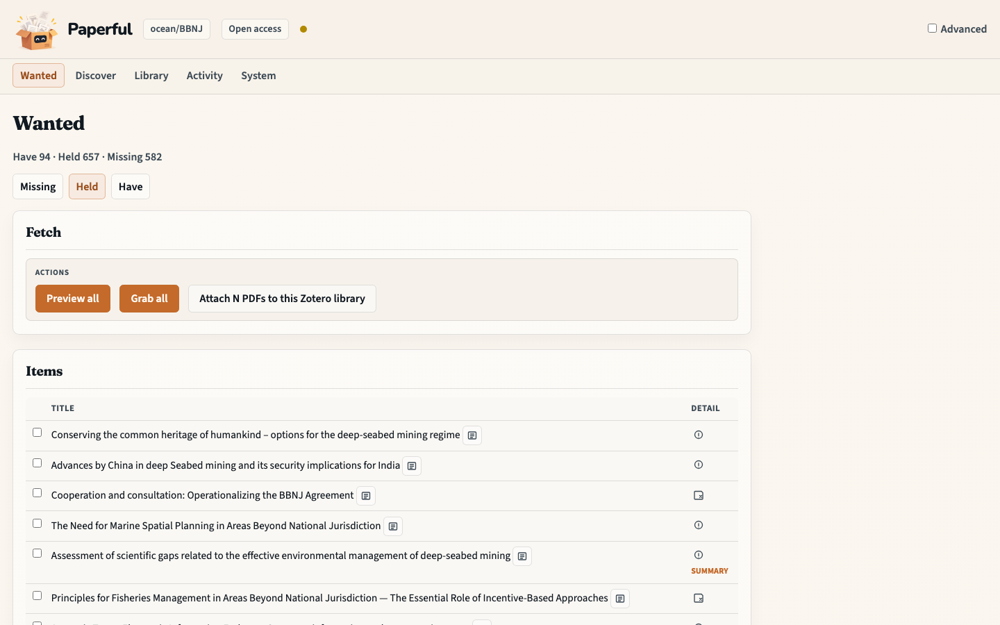
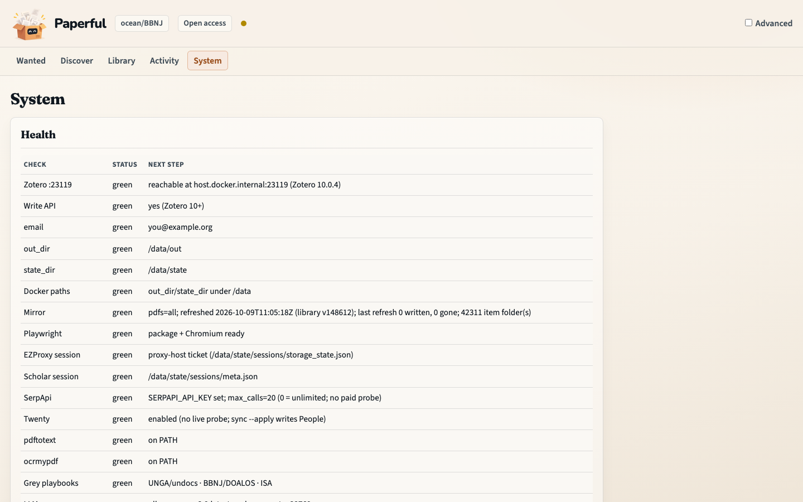

# First fill: missing PDFs onto disk

The shortest realistic path from “this collection still has holes” to PDFs
you can open on this machine.

## Outcome

You will have scoped one collection, **Previewed** a fetch, **Grabbed**
files onto `out/`, opened those files yourself, and **Attached** the copies
you trust into Zotero.

Grab never writes the library. Attach is the write gate.

## Starting point

The workbench is running (`docker compose up` →
http://127.0.0.1:8765). Zotero is open on the host with the local API
enabled. You do not need campus EZProxy or a local model for an open-access
pass (`Open access` on the preset chip).

The screenshots are `ocean/BBNJ`. The clicks are the same for any collection.

## What you’ll do

1. Set the collection chip on **Library**.
2. Open **Wanted** and read Missing / Held / Have.
3. **Preview** (selected rows or all).
4. **Grab** onto `out/` (consumes the preview token).
5. Open `out/` on disk and skim a couple of files.
6. **Attach** into Zotero.

## Walkthrough

1. Open **Library**. Nested collections show item counts and missing-PDF
   counts. Use the target icon on a row to set the collection chip (it
   sticks as a cookie).

2. Open **Wanted**. `GET /` lands here. Counts at the top are Have · Held ·
   Missing. The default tab is the first non-empty bucket. Missing rows use
   miss-surface icons (hover for the plain-language reason).


3. Choose **Preview all** (or tick rows, then Preview selected). Activity
   records the command. If the library changed since preview, Grab refuses
   (HTTP 409) — preview again.

4. Choose **Grab all** (or Grab selected). Files land under `out/` with a
   provenance stamp (`paperful oa:unpaywall`, …). Zotero is unchanged.

5. Open `out/` in your file manager. Trust the disk before notes or Ask.

6. Back on Wanted, open **Held** for downloads that need a human look
   (short PDF, DOI mismatch). **Have** is already-imported copies.



7. Tick the copies you trust and choose **Attach PDFs to this Zotero
   library**. On Zotero 7–9 the files stay on disk until you attach later
   (`paperful attach` on the CLI).

8. **System** is the doctor table if Wanted shows an amber coach line (no
   collection, or the library is down). **Activity** is the command history.



## What to notice

- **Preview → Grab → Attach** is the loop. There is no “attach verified
  automatically” setting.
- Held is not failure. A one-page stub or a DOI mismatch waits for an
  explicit attach (Advanced can allow those holds).
- Open access first. Campus EZProxy is the **Campus** preset after
  `paperful session login ezproxy` on the host — [EZProxy](ezproxy.md).
- Not every paywalled or DOI-less item comes back.

## You should now have…

A collection chip, PDFs under `out/` for the rows Grab could reach, and
those copies attached in Zotero if you asked.

## CLI equivalent

```sh
docker compose run --rm paperful gaps -C ocean/BBNJ
docker compose run --rm paperful run -C ocean/BBNJ --preset oa --dry-run
docker compose run --rm paperful run -C ocean/BBNJ --preset oa --no-attach
# open out/ yourself
docker compose run --rm paperful attach -C ocean/BBNJ
```

## Next

- [Grow the library](grow-library.md) if the collection is still thin
- [Tidy a collection](tidy-library.md) if duplicates or identifiers look messy
- [How it works](how-it-works.md) for the search order behind Grab
- [Research pack](research-pack.md) for works cited inside the PDFs you just filled
