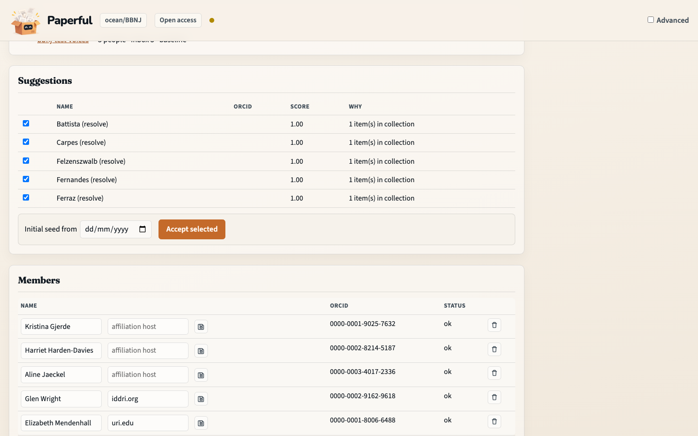

# Grow the library: topic search and people you follow

Add **metadata parents** for works you do not have yet. Filling PDFs is a
later step on [Wanted](first-fill.md). Snowball proposes; you keep, skip,
then apply.

## Outcome

You will have searched a topic (or followed an ORCID), reviewed the queue,
and created catalogue parents for the rows you kept — without fetching PDFs
in the same click.

## Starting point

Workbench at http://127.0.0.1:8765. A collection chip is helpful (new
parents can land there) but topic search itself does not require one.

The screenshots are the Discover page on a live `ocean/BBNJ` chip.

## What you’ll do

1. Open **Discover**.
2. Search a topic; review Keep / Skip.
3. **Preview apply**, then **Add selected**.
4. Optionally follow people by ORCID on the same page.
5. **Fill PDFs** jumps to Wanted for the new parents.

## Walkthrough

### Topic

1. Open **Discover**. **Topic** is a keyword search (`snowball search`,
   dry-run queue).

2. Type a query (for example `area based management`) and **Search**.
   Per-row Keep / Skip marks the queue. Nothing is written to Zotero yet.


3. **Preview apply**, then **Add selected**. That is `snowball apply`
   (metadata only). A stale preview refuses if the library changed.

4. Optional on the same panel: **Briefing** / **Digest** write
   `briefing.md` / `digest.md` on the queue (shown on the page; not
   auto-created). **Keep an eye on this** saves a topic watch only when a
   snowball **profile** is chosen.

5. **Fill PDFs** opens Wanted. Continue with [First fill](first-fill.md).

Advanced (toggle, cookie only) adds crawl kinds (hybrid / DOI / ORCID /
collection), hop knobs, profile save/run, **refs gap**, and **ingest-dois**.
Those are the [research pack](research-pack.md) and [snowball](snowball.md)
surfaces, not the first click.

### People

Same page, lower panel. This is `authorwatch` — people you already follow,
not a keyword hop.

1. Create a named list.
2. **Follow** with an ORCID (optional backfill date). Name-only rows stay
   unresolved until you confirm an iD.
3. **Check again** re-runs the list. Inbox rows use the same Preview →
   apply pattern as topic.
4. **Get suggestions** ranks people already in the collection chip
   (`suggest -C`). Tick **Accept** to put them on the list.



Paperful does not live-scrape ResearchGate or LinkedIn. Save a follows page
and **Import**. Details: [Author watch](authorwatch.md).

## What to notice

- Discover creates **parents**. Wanted fills **PDFs**. Do not conflate them
  with `run`.
- There is no scheduler. **Check again** is the re-run.
- `snowball watch` (saved keyword profile) is not `authorwatch` and not the
  PDF `inbox watch`.

## You should now have…

A reviewed queue, new metadata parents for the rows you applied, and a
clear next step on Wanted.

## CLI equivalent

```sh
docker compose run --rm paperful snowball search "area based management" --gate dry-run
# review state/snowball/<run-id>/
docker compose run --rm paperful snowball apply <run-id> --apply -C ocean/BBNJ
docker compose run --rm paperful authorwatch save ocean-people
docker compose run --rm paperful authorwatch add ocean-people --orcid 0000-0002-1825-0097
docker compose run --rm paperful authorwatch run ocean-people
```

## Next

- [First fill](first-fill.md) for the new parents
- [Research pack](research-pack.md) for works cited inside PDFs you already have
- [Snowball](snowball.md) for hop depth, gates, and watches
