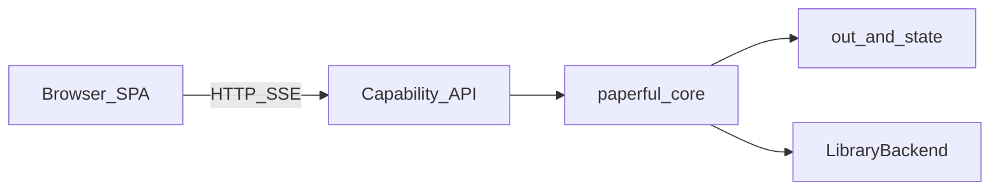

# Paperful GUI (2.0 vision)

**Status: parked.** This is a sketch of a **GUI-enabled 2.0**, not a 0.x or
1.0 deliverable. Today Paperful is a **local CLI** with a quiet disk mirror.
An operator console (commands / settings / RAG), SPA, or Capability API is
**not** Wave D and **not** 1.0. Surfaces like a Zotero plugin are still not
the product direction for 1.0. See [ROADMAP](ROADMAP.md) (trust checklist,
“Not a GUI”) and [quiet mirror](quiet-mirror.md).

The sketch is intentionally ambitious: a **web-native workbench** over the
same five jobs, the same ledger (`out/`, `state/`), and the same library
adapters — deployable as **open (self-host)**, **Docker**, or **SaaS**.
Nothing here blocks tagging 1.0.

---

## 1. Status and non-goals

| In this document | Not in this document |
| --- | --- |
| Long-horizon UI for a GUI-enabled 2.0 | Shipping UI code, wireframes as commitments, or dates |
| Browser-first product surface | A Zotero / Firefox extension as the primary bet |
| Same Control posture as the CLI (dry-run, explicit apply) | Silent library writes or silent cloud source defaults |
| SaaS as a **2.0 deploy mode** | Hosted multi-user service as a near-term ROADMAP item |

**Non-goals even for the 2.0 sketch**

- Systematic-review screening as the primary UX
- A citation-graph playground as the main surface
- Chat-over-library as the **default** way to use Paperful (a built-in,
  opt-in **Ask / chat with collection** mode is in scope for 2.0 — see
  [§ Ask](#ask-chat-with-collection) and [ROADMAP — GUI](ROADMAP.md#gui))
- Replacing Zotero sync or becoming a WebDAV client
- Assuming `localhost:23119` inside SaaS without a remote adapter path
- Shipping Sci-Hub, Scholar, or LLM as on-by-default

PDF preview in the browser is a convenience. The citation manager can remain
the annotation / reader of record unless a later 2.0 decision claims that
job explicitly.

---

## 2. Product framing

Paperful’s jobs stay [library, find, completeness, mirror, control](why.md).
The GUI is another **surface** on a shared **capability API** — the same
verbs the CLI already expresses (`--format json` / optional thin `paperful mcp`
for `refs_gap` + `ask`). It does not invent a second fetch stack or a second
item schema.

```text
  Browser UI  ──HTTP──►  Capability API  ──►  paperful.* (snowball, run, lint, …)
                              │
                              ├── LibraryBackend (Zotero / Mendeley / EndNote / …)
                              └── Ledger: out/ + state/  (per workspace in SaaS)
  CLI / MCP  ─────────────────┘
```

**Deploy matrix**

| Mode | Who runs it | Ledger | Manager connect |
| --- | --- | --- | --- |
| **Open** | Operator self-hosts UI + API | Local or mounted `out/` / `state/` | Local Zotero API when on the same host; proven remote adapters when available |
| **Docker** | Compose serves UI + API | Volumes for ledger | Same as open; headed `session login` / Zotero desktop still need the host where applicable ([docker.md](docker.md)) |
| **SaaS** | Hosted multi-tenant | **Per-workspace isolated** ledger | OAuth / Web API-class adapters — not localhost Zotero inside the cloud |

Control rules are identical in all three modes: dry-run before write, explicit
Apply, opt-in Scholar / Sci-Hub / LLM / browser-agent.

---

## 3. Information architecture

One shell, not a dashboard of unrelated widgets. Scope is always visible;
the center pane changes with the job mode.

```text
┌──────────────────────────────────────────────────────────────────────────┐
│  Paperful   [collection tree ▾]  year · type · profile · pack            │
│  write-API: yes/no     dry-run ▸   preset ▾                              │
├────────────┬─────────────────────────────────────────────┬───────────────┤
│  Grow      │  Mode table                                 │  Detail       │
│  Fill      │  (candidates / items / patches / packs)     │  biblio card  │
│  Repair    │                                             │  PDF preview  │
│  Mirror    │                                             │  (if on disk) │
│  Reports   │                                             │               │
│  Ask       │                                             │  citations    │
│  Doctor    │                                             │               │
├────────────┴─────────────────────────────────────────────┴───────────────┤
│  Run rail: banner  downloaded N · attached M · …   │  live log / errors │
└──────────────────────────────────────────────────────────────────────────┘
```

| Region | Role |
| --- | --- |
| **Scope chrome** | Collection path (adapter + `out/_collections.json`), year/type filters, active run profile, open pack |
| **Job modes** | Grow · Fill · Repair · Mirror · Reports · Ask · Doctor / Setup |
| **Center table** | Mode-specific rows with multi-select and status |
| **Detail** | Title, authors, year, venue, ids, notes, attachments; PDF when present under `out/` |
| **Run rail** | Dry-run default, gate/preset, one-line trust banner, write-API indicator, streamed log |

---

## 4. Modes (verbs and disk artifacts)

Every panel maps to an existing verb or ledger path. The UI marshals
arguments; the server runs `paperful.*`.

### Grow

Snowball, snowball watch, and authorwatch. See [snowball.md](snowball.md) and
[authorwatch.md](authorwatch.md).

| Action | Maps to | Ledger |
| --- | --- | --- |
| Keyword / DOI(s) / ORCID(s) / collection / hybrid seed | `snowball search\|doi\|orcid\|collection\|hybrid` (`doi` / `orcid` accept several seeds) | `state/snowball/<run-id>/` |
| Candidate table | Parse `paperful.snowball.candidate.v1` | `candidates.jsonl`, `summary.json` |
| Toggle keep / batch approve | Edit `keep` then `snowball apply` | Same queue |
| Gates | `dry-run` · `approve-each` · `approve-batch` · `auto` | Request + config |
| Watch inbox | `snowball watch run` / `show` | `state/snowball/watches/<name>/inbox.jsonl` |
| People lists | `authorwatch save` / `run` / `apply` | `state/authorwatch/<name>/` |

Default gate in the UI is **dry-run**. Writing gates require a target
collection. Watch never auto-schedules: show last run and **Run now**;
launchd / cron stay outside Paperful.

### Fill

Missing PDFs for items already in the library.

| Action | Maps to | Notes |
| --- | --- | --- |
| Gap count | `gaps` | Same scope filters as CLI |
| Would-hit / fetch | `run --dry-run` then `run` | Resume, `--retry-failed`, `--upgrade-linked`, presets |
| One hard item | `recover --item` | Opt-in LLM / browser-agent |
| Scanned PDF text layer | `ocr` / `ocr --apply` | Before summarize / LLM lint |

### Repair

Completeness without pretending to be a full metadata editor.

| Action | Maps to | Ledger |
| --- | --- | --- |
| Findings | `lint` | Findings in report / UI table |
| Patch queue | `fix-metadata` then `--apply` | `state/metadata-patches.jsonl` |
| Duplicates | `dedupe` then gated apply | `state/dedupe-packs/` |
| Preprint ↔ VoR | `versions` | `state/version-packs/` |
| Attachment hygiene | `attachments` + flagged `--apply` | Report first; surgery only on apply |

### Mirror

Browse and thicken the quiet mirror — not a second sync product.

| Action | Maps to | Ledger |
| --- | --- | --- |
| Browse items | Read `record.json` (+ PDF) | `out/<collection>/<stem -- KEY>/` |
| Snapshot | `snapshot` | `out/_index.jsonl`, `_collections.json`, `_history.json` |
| Restore | `restore` then `--apply` | Create missing only; never overwrite live fields |

### Reports

| Action | Maps to | Ledger |
| --- | --- | --- |
| Last run / filters | `report` | `state/last-run.json`, `state/runs/` |
| Pack witness | `pack open` … `close` | `state/packs/` |
| Grounded briefs | `summarize` / `synthesize` | `state/summaries/`, `state/reports/`; apply still explicit |

`[llm].enabled` stays off until the operator turns it on (setup pane or
config). Proposals never mutate the library alone.

### Ask (chat with collection)

Built-in, **opt-in** conversational surface over the **scoped** library
(PDFs under the quiet mirror, indexed by `paperful rag ingest`). Same Control
posture: scope is always visible in the chrome; answers must show **citations**
(item key, title, page / snippet — not free-floating model text). Maps to the
CLI layer in [rag.md](rag.md) and [ROADMAP — Zotero-RAG
integration](ROADMAP.md#zotero-rag-integration-later-question-centric-layer).
The single-question path (`paperful ask`) is shipped; `--thread` stores follow-ups
under `state/rag/threads/` and retrieves on a rewritten query.

| Action | Maps to (Capability API) | Notes |
| --- | --- | --- |
| New thread | `rag.answer(question, keys=scope)` with scope = active `-C` + filters | Requires index freshness; `paperful rag status` shows what is stale |
| Follow-up | `rag.answer(question, history=turns)` plus `paperful ask --thread` / `state/rag/threads/` | Follow-up query rewrite is shipped on the CLI; no silent widening of scope mid-thread |
| Focus / prompt preset | `--focus` or profile field | Question-centric vs summary-style system prompts |
| Export thread | Write `state/rag/…` report JSON; optional child note | Explicit Apply for Zotero writes |
| Batch from file | Upload / paste questions → cited answer table | Parity with CLI batch ingest |

UI patterns: chat pane in the center (or split with detail), citation chips
that open the **Detail** biblio card and PDF preview when on disk; optional
side panel for “questions extracted from this item” when that lane exists.
Not a general web search box — retrieval stays local to the workspace ledger.

### Doctor / Setup

| Action | Maps to |
| --- | --- |
| Readiness | `doctor` (amber/red, next-steps when adapter down) |
| Collections probe | `collections` |
| Profiles | `profile list` / `show` / save — same TOML as CLI |
| Sessions | `session status` / login (open & Docker: host-capable path; SaaS: adapter-appropriate OAuth) |

---

## 5. Control invariants

Hard rules for every deploy mode:

1. **Dry-run before write** for bulk jobs; UI defaults match CLI stranger-safe defaults.
2. **Explicit Apply** for library writes, merges, restores, and attachment surgery.
3. **Opt-in only:** Scholar, Sci-Hub, LLM, browser-agent recovery.
4. **No built-in watch scheduler** — Run now / last-run only.
5. **Config is shared** — profile and config edits write the same TOML the CLI reads (open/Docker) or the workspace-equivalent store (SaaS).
6. **Secrets never in the browser** — API keys and OAuth tokens live in a server-side vault / env.
7. **One-line trust banner** after runs: `downloaded N · attached M · deferred K · not_found J` plus write-API yes/no.

---

## 6. Architecture (web-native first)

**Chosen default:** browser SPA (or light SSR) + **HTTP capability API**
(ASGI / FastAPI-class) wrapping existing `paperful.*` entrypoints. The same
API backs open, Docker, and SaaS.

**Not the 2.0 primary product:** Textual, Tk, PyQt, or Tauri-first. Optional
later: a thin native shell that loads the same web app; optional early TUI
only for queue review.



| Concern | Approach |
| --- | --- |
| Long jobs | Async run ids; progress via SSE or WebSocket; cancellable |
| Fetch / OpenAlex / snowball | Server only — UI never reimplements lanes |
| Refresh | Server owns writes; UI subscribes to run events and reloads tables |
| Auth (open) | Single-user or reverse-proxy SSO |
| Auth (SaaS) | Workspace accounts; per-workspace ledger isolation; secrets vault |
| Docker | First-class compose profile for UI + API + ledger volumes; document host GUI needs for Zotero authorize / headed login |

SaaS must not pretend the cloud pod can reach the user’s desktop Zotero.
Remote-capable adapters (Web API / OAuth) are a prerequisite for that mode;
until those exist, SaaS is limited to ledger-only / import-export style
workspaces or stays unimplemented.

---

## 7. Phased path to GUI-enabled 2.0

Planning ladder, not a calendar. Each phase can stop without the next.

| Phase | Outcome | Deploy focus |
| --- | --- | --- |
| **P0** | Lock schemas; carve a stable capability API from today’s CLI (still 1.0 work) | CLI only |
| **P1** | Web **read-only** review: snowball queues, patch list, dedupe / version packs | Open + Docker |
| **P2** | Gated write-back over HTTP: `keep` / `apply`, patches, scoped `run` | Open + Docker |
| **P3** | Full workbench modes + in-browser PDF preview | Open + Docker |
| **P3b** | **Ask** — chat with collection (cited RAG over scoped index; `[llm]` + index gates) | Open + Docker |
| **P4** | SaaS tenancy (auth, workspace isolation, remote manager adapters) + polish (export, tagging UI if that lane exists; Ask when remote index + LLM policy allow) | SaaS |

P0 does not ship a GUI. It makes a later GUI honest.

---

## 8. Risks and open questions

- **Remote Zotero / manager parity** — SaaS is blocked on adapters that do not need localhost.
- **Session / EZProxy in the browser product** — headed Chromium login remains host-sensitive; SaaS may never offer campus SSO the same way open/Docker do.
- **Multi-writer ledgers** — Syncthing-style shared `state/` vs SaaS workspace isolation need different conflict stories; do not blur them.
- **Capability API shape** — prefer one typed surface for CLI, HTTP, and MCP rather than three parallel wrappers.
- **Reader of record** — decide deliberately if PDF annotation moves into Paperful or stays in the manager.

---

## Related docs

- [ROADMAP](ROADMAP.md) — 1.0 trust checklist; GUI section points here
- [architecture.md](architecture.md) — disk-first adapters and data flow
- [why.md](why.md) — five jobs
- [snowball.md](snowball.md) — candidates, gates, watch
- [workflows.md](workflows.md) — `all` / profiles (CLI today)
- [quiet-mirror.md](quiet-mirror.md) — `out/` as the copy you keep
- [docker.md](docker.md) — operator image and host GUI constraints
