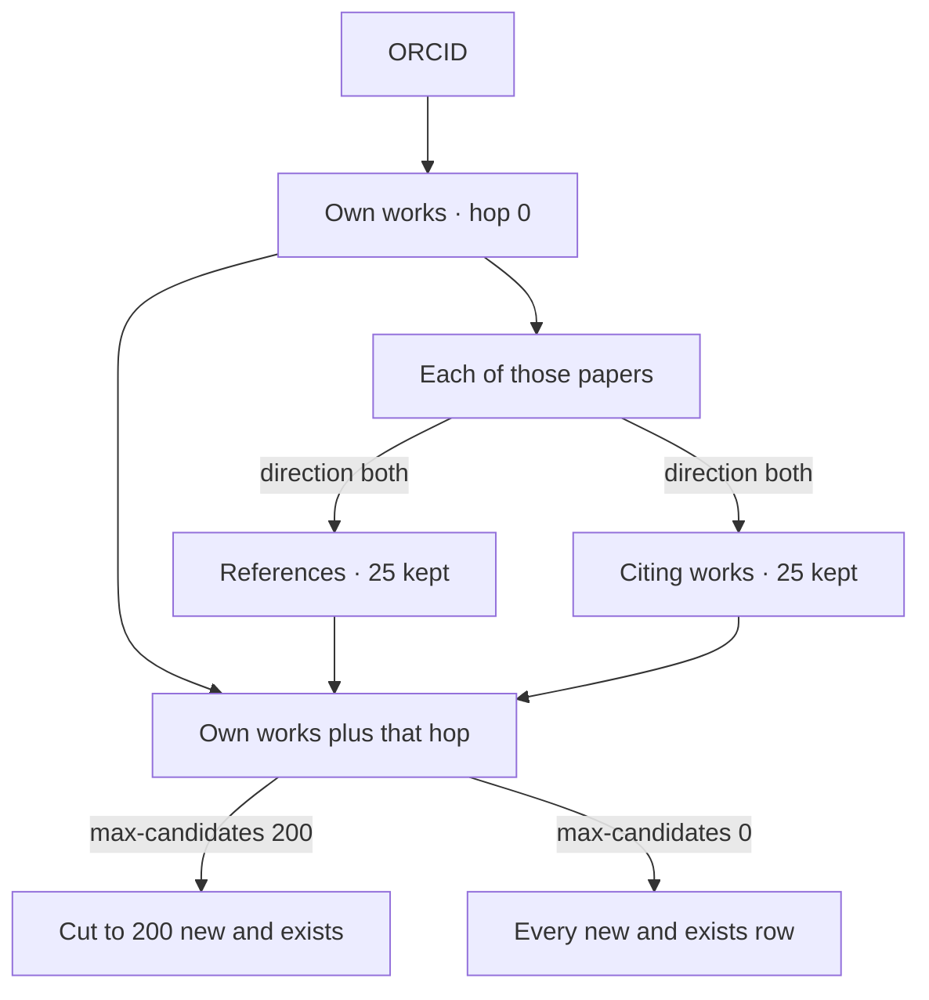

# Snowball

**Status:** keyword search, DOI / ORCID / collection seeds, `hybrid` (keyword
hits, then one hop), refs and cited-by, depth up to 5 under caps, gates
`dry-run` / `approve-each` / `approve-batch` / `auto`, overlap ranking, and
`--fetch-pdfs` are implemented. Config honors `dedupe_scope`, `tag_prefix`,
`types`, `oa_only`, venues, `languages`, `min_seed_citations`,
`note_provenance`, and `backends`. `--refine` writes query suggestions when
`[llm]` is on and does not create items. `expand = cited_authors` stays off.
Phases live in [ROADMAP](ROADMAP.md#snowball).

Snowball grows a library outward from a keyword, a DOI, a person, or an
existing collection. It proposes works, then creates items under an explicit
gate. [`run`](commands.md) fills PDFs for items that already exist. `fetch_pdfs`
can do that in the same process, limited to the keys just created. How far
one command reaches is [drawn below](#how-a-hop-is-cut).

```text
paperful snowball search "area based management tools" --year-from 2018
paperful snowball doi 10.1038/s41586-021-03819-2 --depth 2 --direction both
paperful snowball orcid 0000-0002-9162-9618
paperful snowball collection "Inbox/Seeds" --direction refs
paperful snowball run --profile doi-refs-gated
paperful snowball apply <run-id> -C "Inbox/Snowball"
paperful snowball hybrid "high seas EIA" --hybrid-seeds 5 --direction refs
paperful snowball search "high seas EIA" --gate auto --fetch-pdfs fast -C "Inbox/Snowball"
paperful snowball orcid 0000-0002-9162-9618 --gate auto --fetch-pdfs full -C "Snowball/0000-0002-9162-9618"
```

`search`, `hybrid`, `doi`, `orcid`, and `collection` are seeds under one verb.
`hybrid` is the keyword-then-hop job. There is no separate top-level
`harvest`, `crawl`, or `discover`.

## Snowball and run

| Job | Command | What you are doing |
| --- | --- | --- |
| Build | `paperful snowball …` | Find works and, if the gate says so, create parents |
| Fill | `paperful run` | PDFs and attach for items already in the library |

A dry-run ends with “candidates ready”. A writing gate with `fetch_pdfs = off`
ends with “items created (metadata only)”. Downloaded and attached appear in
the summary only after `fast` or `full` has run.

A snowball profile is a named job in `profiles/`. `paperful run` and
`paperful all` refuse it. Fetch profiles stay fetch profiles.

## Seeds

| Seed | What it collects | Default depth |
| --- | --- | --- |
| Keyword | OpenAlex title/abstract search | **0** — the hit list. Depth 1+ expands those hits and must be set explicitly. A global `depth = 1` does not expand every keyword hit |
| Hybrid | That hit list, then one hop from the top `hybrid_seeds` DOIs (default 5) | The hop is always 1. `--depth` does not add further hops |
| DOI | The work’s neighbours (`referenced_works` and/or works that cite it) | **1**, direction `refs` by default. Use `--direction cites` or `both` for cited-by |
| ORCID | That person’s works (ORCID public API, filled by OpenAlex author filter), then the same expander | **1**. [One hop out](#how-a-hop-is-cut) from those works |
| Collection | DOIs already in the seed collection path, then the same expander | **1**. `-C` is the write target (defaults to the seed path) |

`expand = cited_authors` (every paper by every cited author) stays off. It
is a later, capped switch.

## How a hop is cut

An ORCID run starts at that person’s own works (hop 0). `--depth 1` takes
one hop out from those works and stops. It does not walk the neighbours’
neighbours. `--direction both` takes references and citing works. Each side
is capped on its own: `--per-hop-limit 25` keeps 25 references and 25 citing
works per paper. `--per-hop-rank` chooses which ones: `most-cited` (default),
`least-cited`, or `random`. Use `all` (or `0`) on either cap for every
neighbour or every row. After that hop, `max_candidates` (default 200) can
still cut the `new` + `exists` list.

```text
paperful snowball orcid 0000-0002-9162-9618 --depth 1 --direction both --per-hop-limit 25 --per-hop-rank most-cited --max-candidates all
```



DOI and collection seeds use the same hop. The centre is the seed papers,
not a person’s works. Keyword search stays on the hit list unless you set
depth. The usual numbers are in [Stop rules](#stop-rules).

`direction` including `keywords` adds another side. OpenAlex stores at most
five scored keywords on a work. The hop takes the top `keyword_limit` (default
3) at or above `keyword_min_score` and requests works with any of those slugs
(`keywords.id:a|b|c`), then keeps `keyword_hop_limit` of them. `all` is refused
on both keyword caps: the matching literature is not a closed neighbour list.

Works with no topic have no keywords. That is about 12% of OpenAlex. When
keywords are in the direction, the run says how many seeds have none and will
not expand on that side:

```text
2 of 5 seeds have no OpenAlex keywords and will not expand on that side.
```

Those seeds are skipped on the keyword side only. References and cited-by
still run. If keywords is the only side and every seed lacks keywords, the
command exits 2 with that sentence and does not query.

## Gates

The gate is a config value. The default for a new user is `dry-run`.

| Gate | Library writes | When |
| --- | --- | --- |
| `dry-run` | None | Always safe. `fetch_pdfs` is ignored |
| `approve-batch` | Only `keep = true` rows | `snowball apply <run-id>`. A second apply skips DOIs already created |
| `approve-each` | Each yes on `status = new` | Short lists, at most `approve_each_max` (default 20), and only on a terminal. No rows stay `keep = false`. Over the cap, or without a terminal, the command exits 2 and points at `approve-batch` |
| `auto` | Every `status = new` row under the caps | A named profile, after you have dry-run that job once |

`dry-run`, `approve-batch`, `approve-each`, and `auto` are the gates. A writing
gate (`approve-batch`, `approve-each`, `auto`) requires a target collection and
stops before the crawl if it is missing. Paperful may create that collection
path. It does not invent a silent default collection. `auto` is not a scheduler.

Dedupe runs before create: normalized DOI against `dedupe_scope` (`library`
by default, or `collection`, or `none` logged loudly), then the existing
title+year fingerprint. Only `status = new` rows can become parents.

## One-shot PDFs

`fetch_pdfs` is a mode. The default is `off`.

| Mode | What happens after create |
| --- | --- |
| `off` | Metadata only. Fetch later with `paperful run -C` on that collection |
| `fast` | First pass on the new keys: configured sources, no vault browser. `true` means this |
| `full` | That first pass, then the same stack as `run` (browser lanes, and the recover agent when `[llm]` is on) for keys that still have no PDF |

```text
paperful snowball search "BBNJ EIA" --gate auto --fetch-pdfs fast -C "Inbox/Snowball"
paperful snowball orcid 0000-0002-9162-9618 --gate auto --fetch-pdfs full -C "Snowball/me"
```

Both modes stay on the keys snowball just created. Sci-Hub and Scholar run
only when they are already in `sources`. `full` prints the Sci-Hub and
browser-recovery lines when those lanes are in the second pass. If attach
fails, the parent remains and the report counts `attach_deferred`.

Example profile `keyword-library`: `gate = auto`, `fetch_pdfs = true` (fast),
`target_collection` set. `keyword-scout` is the dry-run twin.
`doi-refs-gated` is approve-batch. `orcid-ego-auto` creates metadata only.

## Stop rules

The picture is [How a hop is cut](#how-a-hop-is-cut).

| Knob | Default | Meaning |
| --- | --- | --- |
| `depth` | 0 for keyword, 1 for DOI / ORCID / collection | Hops from the seed. Soft ceiling 5 |
| `direction` | `refs` | `refs`, `cites`, `both`, `keywords`, `refs+keywords`, `cites+keywords`, or `refs+cites+keywords`. `both` stays references plus cited-by |
| `keyword_limit` | 3 | How many of a work's OpenAlex keywords to expand. Integer 1–5. `all` and `0` are errors. 5 uses every keyword OpenAlex stored (at most five) |
| `keyword_hop_limit` | 50 | Works kept per seed on the keyword side. A positive integer. `all` and `0` are errors. A keyword filter is an open query, so it never pages without a cap. Citation `per_hop_limit = all` still applies on a mixed run |
| `keyword_min_score` | 0 | Drop seed keywords below this similarity. 0 keeps whatever OpenAlex already assigned |
| `max_candidates` | 200 | Stops after this many `new` + `exists` rows. `all` (or `0`) keeps every row |
| `per_hop_limit` | 50 | Neighbours kept per seed work per hop (references and cited-by). `all` (or `0`) keeps every one OpenAlex returns |
| `per_hop_rank` | `most-cited` | How a numeric `per_hop_limit` picks neighbours: `most-cited`, `least-cited`, or `random` |
| `year_from` / `year_to` | unset | Drop candidates outside the window |
| `types` | journal-article-shaped | OpenAlex / Zotero types |
| `oa_only` | false | Metadata filter only. It does not change the PDF chain |
| `min_seed_citations` | 0 | Skip cited-by expansion when the seed is below this count |
| `languages`, `venue_include`, `venue_exclude` | unset | Applied when the source has the field. A missing language does not drop the row |
| `hybrid_seeds` | 5 | How many top DOI hits `hybrid` expands |
| `approve_each_max` | 20 | Largest `approve-each` list. Above this, use `approve-batch` |
| `refine` | false | With `[llm].enabled`, write up to five query suggestions. They do not start a second crawl |

A seed that fails to resolve is `status = error`. Other seeds continue. The
process exits non-zero if any seed failed, using the existing exit ladder
(`2` for config / doctor).

## Progress

A long crawl keeps a progress bar at the bottom of the terminal, the same bar `run` and `attach` use. The label is coloured by step: cyan for hops and references, blue for cited-by, magenta for Crossref and Semantic Scholar, green while items are created, cyan while PDFs are fetched. When the step has a known length (reference ids, cited-by seeds, rows to fill, items to create, PDFs to fetch) the bar shows done/total. Otherwise it spins. A stage line is printed when the step changes (`hop 1/2 · 40 seeds · both`). When the run finishes, one summary line remains:

```text
hop 1/2 references · 80 ids · 40 searches · 800 papers
crossref · 30 searches · 15 fields updated
fetching PDFs · 4 PDFs
creating · 12 created
```

Counts start over when the step changes, so a references hop does not repeat fill or PDF totals. `searches` counts reads in that step (OpenAlex, Crossref, or Semantic Scholar). `papers` counts OpenAlex works returned. `fields updated` counts empty title, year, venue, or author fields filled. `PDFs` counts files saved while `fetch_pdfs` runs. `created` counts items written while they are created.

## Candidate record

Each run writes `state/snowball/<run-id>/candidates.jsonl` and `summary.json`.
The summary counts requests, HTTP 429s, retries, and rows by status, backend,
and hop.

Schema `paperful.snowball.candidate.v1`:

| Field | Contents |
| --- | --- |
| `schema`, `run_id` | Version and run id |
| `seed` | `{type, value}` — keyword, doi, orcid, or openalex |
| `hop` | Integer. Search hits are 0. References of a seed are 1 |
| `direction` | `search`, `refs`, `cites`, `keywords`, or `orcid` (the person’s own works) |
| `ids` | Normalized doi, openalex, s2, pmid, orcid, when known |
| `biblio` | Title, year, authors, venue, type, optional OA url |
| `why` | Short reason, for example `ref of 10.xxxx/yyyy` |
| `status` | `new`, `exists`, `filtered`, or `error` |
| `exists_match` | When `exists`: `item_key` and `doi` or `title_year` |
| `provenance` | Backend, endpoint, `retrieved_at` |
| `gate` | The gate for this run |
| `score` | `overlap * 1000 + cited_by_count` for neighbours. Search hits stay on `cited_by_count` |

The dry-run table shows title, year, DOI, why, in library, hop/direction,
and backend, with `new` rows first. Created items are tagged
`paperful-snowball` and `paperful-snowball:<backend>`. A child note holds the
seed, direction, hop, why, run id, and schema version. API keys and the
mailto address never go in that note.

## Config

Precedence matches [run profiles](config.md#run-configs-profiles): built-in
default, then `[snowball]` in `config.toml`, then `profiles/<name>.toml`,
then flags on the command.

```toml
[snowball]
enabled = false          # doctor and the CLI refuse snowball until true
depth = 1                # keyword runs still default to depth 0
direction = "refs"
max_candidates = 200
per_hop_limit = 50         # all keeps every neighbour of a seed
per_hop_rank = "most-cited"  # most-cited | least-cited | random
gate = "dry-run"         # dry-run | approve-each | approve-batch | auto
target_collection = ""
dedupe_scope = "library" # library | collection | none
fetch_pdfs = "off"       # off | fast | full. true means fast
tag_prefix = "paperful-snowball"
note_provenance = true
backends = ["openalex", "crossref", "semanticscholar", "orcid"]
languages = []           # empty = do not filter; a missing language is kept
min_seed_citations = 0
hybrid_seeds = 5
approve_each_max = 20
refine = false           # suggestions only; needs [llm].enabled
```

`enabled = false` until you opt in, the same posture as `[llm]`. `doctor`
reports that flag, whether keys are present, and whether a backend answers.
A missing OpenAlex key warns. A missing Semantic Scholar key does not, and neither missing key aborts the other backends.

`email` at the top of `config.toml` is the contact address for Unpaywall and Crossref.
OpenAlex ignores `mailto`. Snowball calls OpenAlex without an API key first, so a small search needs no account. That free allowance is shared by everyone on the same public address (a campus network or VPN exit included) and is about a tenth of a free key. When it runs out, a configured `OPENALEX_API_KEY` takes over for the rest of the crawl. With no key, the partial queue is kept and `paperful snowball resume` continues after you add one. One key only: a second free key or a `user+tag@gmail.com` alias does not add budget. A free key is about $1/day.

Semantic Scholar’s Academic Graph is public, so snowball calls it with no key. That unauthenticated pool is shared and can be throttled. Heavier use needs a private key: [request one](https://www.semanticscholar.org/product/api#api-key-form) (it arrives by email; the introductory limit is 1 request per second). Put it in `SEMANTIC_SCHOLAR_API_KEY`. Like `OPENALEX_API_KEY`, it stays in the environment, never in `config.toml`.

Each crawl writes `state/snowball/<run-id>/candidates.jsonl` as it goes, for OpenAlex, Crossref, Semantic Scholar, and ORCID alike. A rate limit, outage, or interrupt keeps that file and `deferred.json`. Continue with:

```sh
paperful snowball resume <run-id>
```

A list call that hits the daily budget of the key already in use stops the same way. The reset is midnight UTC, or sooner if you add prepaid credit on that key.

Short 429s and 5xx responses retry with exponential backoff. A reset of a minute or more does not keep polling until midnight.
`snowball profile save` writes seeds and knobs only, after a successful
dry-run, or with `--force`. It refuses to store a key.

Backends resolve in order and emit each work once, keyed by DOI: OpenAlex
first, Crossref fills empty metadata fields, Semantic Scholar fills reference
gaps with or without a key, ORCID for the person’s own work list. OpenAlex wins when it and Crossref
disagree on a field that both filled. Semantic Scholar responses are cached
under `state/snowball/cache/`. `backends` must include `openalex`. An unknown
name is a config error. Dropping `orcid` skips the public works list and keeps
the OpenAlex author filter.

`snowball run --profile NAME` prints that profile’s one-line description
before any request. `mode` is `search`, `hybrid`, `doi`, `orcid`, or
`collection`. `snowball profile save --query … --hybrid` stores `mode = "hybrid"`.

`--refine` (or `refine = true` on a profile) asks the configured model for
query strings and prints them. If `[llm]` is off, or the call fails, the crawl
still finishes and `summary.json` records `suggestions_error`. Suggestions are
not seeds.

## Where the crawl comes from

The personal site already does this hop for a people graph, not for Zotero:

| Site | Snowball |
| --- | --- |
| `processing/library/citations.py` | One-hop `referenced_works` and `filter=cites:` |
| `_data/openalex.yml` | `[snowball]` plus `profiles/*.toml` |
| `processing/library/s2_citations.py` | Optional Semantic Scholar fill, disk cache under `state/` |
| `processing/library/work_identity.py` | DOI, ORCID, and title normalization, aligned with `dedupe` |
| No Zotero writes | `create_parent` and `ensure_collection_path` |

Leave on the site: the people-graph JSON, the hard-coded ego slug, Jekyll
outputs, and `scholar_citations.py`.

## What to reuse elsewhere

OpenAlex is the graph (search, author, `referenced_works`, `cites:`). The
ORCID public API is the person’s own works; those lists are often incomplete,
so OpenAlex expands them. Semantic Scholar references and citations fill gaps
on the public API; a key is only for heavier use. Crossref, already used to verify DOIs, fills metadata
gaps. It is not the forward-citation graph.

Adjacent tools, and the piece worth copying:

| Tool | Copy | Leave there |
| --- | --- | --- |
| [findpapers](https://github.com/jonatasgrosman/findpapers), [opencite](https://github.com/neuromechanist/opencite) | `direction`, `depth`, per-hop cap, dedupe before emit | The package, and any Scopus / Web of Science / IEEE requirement |
| [paperscraper](https://github.com/jannisborn/paperscraper) | — | DOI-list PDFs when you have no Zotero. See [comparison](comparison.md) |
| [litsearch](https://pypi.org/project/litsearch/), [lit-review-mcp](https://github.com/Bethww/lit-review-mcp), [CoLRev](https://colrev-environment.github.io/colrev/) | Flag ideas | The review project, the report, the screener |
| [Citation Gecko](https://github.com/CitationGecko/gecko-react) | Overlap rank: neighbours score `overlap * 1000 + cited_by_count` | The network UI |
| [zotero-snowball](https://github.com/socratic-irony/zotero-snowball), [Citegeist](https://github.com/phdemotions/zotero-citegeist) | — | In-Zotero one-hop dialogs |
| [pyalex](https://github.com/J535D165/pyalex) | — | A second HTTP client. Snowball extends the client paperful already uses for OpenAlex (mailto, sleep, backoff) |

ResearchRabbit, Litmaps, Connected Papers, Inciteful, Elicit, Consensus,
Scite, and Lens.org stay outside. `--refine` can suggest further queries behind
`[llm]`; it does not pick seed DOIs. Google Scholar stays the
existing PDF lane. It is not a snowball source. Screening a RIS file stays
with ASReview. Created items keep clean creators, DOI, and date so Better
BibTeX citekeys still make sense. Snowball does not depend on that plugin.

## Out of this lane

- A hosted discovery service, a force-directed graph, or a second OpenAlex browser
- Cron, or a snowball step inside `paperful all`
- A TUI or local web reviewer
- Sci-Hub or Scholar as ways to discover works
- Pulling every publication of every cited author, until an explicit capped switch exists

## Related docs

- [ROADMAP](ROADMAP.md#snowball) — phases
- [comparison](comparison.md) — paperscraper, findpapers, in-Zotero plugins
- [config](config.md#run-configs-profiles) — profile precedence this lane reuses
- [commands](commands.md) — `run`, which `fetch_pdfs` calls
