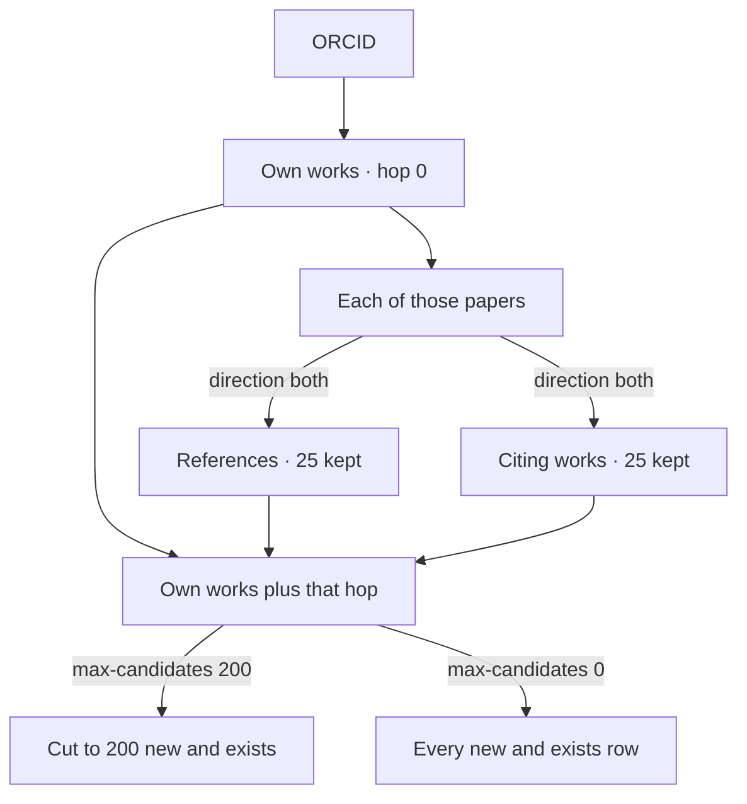

# Snowball

**Status:** keyword search (multi-term AND / `--or`, trailing `*` stem
expansion), multi-DOI / multi-ORCID / collection seeds, `--seeds-file`,
`hybrid` (keyword hits, then one hop), refs, cited-by, and
OpenAlex keywords, depth up to 5 under caps, gates
`dry-run` / `approve-each` / `approve-batch` / `auto`, overlap ranking,
`--fetch-pdfs`, `--dedupe-scope` per invocation, optional `--dedupe-after`,
opt-in author-site preflight / `snowball packs promote`, and pull-only `watch`
are implemented, plus a frontier `digest` on a saved queue or watch.
Config honors `dedupe_scope`, `tag_prefix`, `default_tags`,
`types`, `oa_only`, venues, `languages`, `min_seed_citations`,
`note_provenance`, and `backends`. `--refine` writes query suggestions when
`[llm]` is on and does not create items. `expand = cited_authors` stays off.
Phases live in [ROADMAP](ROADMAP.md#snowball).

Snowball grows a library outward from a keyword (or several), one or more DOIs,
one or more people (ORCID), or an existing collection. It proposes works, then
creates items under an explicit gate. [`run`](commands.md) fills PDFs for items
that already exist. `fetch_pdfs` can do that in the same process, limited to the
keys just created. How far one command reaches is [drawn below](#how-a-hop-is-cut).

```text
paperful snowball search "area based management tools" --year-from 2018
paperful snowball search "marine spatial planning" "offshore renewable energy"
paperful snowball search msp ore --or
paperful snowball doi 10.1038/s41586-021-03819-2 --depth 2 --direction both
paperful snowball doi 10.1038/s41586-021-03819-2 10.1126/science.aao5646
paperful snowball orcid 0000-0002-9162-9618
paperful snowball orcid 0000-0002-9162-9618 0000-0002-1825-0097 --depth 1
paperful snowball collection "Inbox/Seeds" --direction refs
paperful snowball run --profile doi-refs-gated
paperful snowball apply <run-id> -C "Inbox/Snowball"
paperful snowball hybrid "high seas EIA" --hybrid-seeds 5 --direction refs
paperful snowball search "high seas EIA" --gate auto --fetch-pdfs fast -C "Inbox/Snowball"
paperful snowball orcid 0000-0002-9162-9618 --gate auto --fetch-pdfs full -C "Snowball/0000-0002-9162-9618"
paperful snowball search "high seas EIA" --gate dry-run --format json
paperful snowball apply <run-id> -C "Inbox/Snowball" --format json
paperful snowball watch save bbnj --profile keyword-scout
paperful snowball watch run bbnj --digest
paperful snowball watch digest bbnj
paperful snowball digest --run-id <run-id>
paperful snowball watch briefing bbnj
```

`--format json` on crawl (`search` / `hybrid` / `doi` / `orcid` / `collection`),
`run`, `resume`, and `apply` prints one
[`paperful.agent.json.v1`](commands.md#exits) object on stdout (run path +
summary; progress on stderr). Mixed `apply` writes exit **3**. Prefer that
over MCP for shell agents.

`search`, `hybrid`, `doi`, `orcid`, and `collection` are seeds under one verb.
`search` and `hybrid` take one or more keyword terms (AND by default; `--or`
matches any). `doi` and `orcid` take one or more seeds in a single crawl
(shared caps / gate / `-C`). `hybrid` is the keyword-then-hop job. There is no
separate top-level `harvest`, `crawl`, or `discover`. `watch` re-runs a saved
profile on a schedule you choose; see [Watch](#watch).

## Watch

A watch is a saved snowball profile plus a seen-set on disk. You run it when
you want. Paperful does not schedule it (your own launchd or cron may call
`watch run`). The first run records the current frontier and proposes nothing.
Later runs write only works that were not in that set. Creating items stays on
`snowball apply` (or a separate writing-gate crawl). Watch always forces
`gate = dry-run` and `fetch_pdfs = off`, so a profile with `gate = auto` cannot
create parents or download PDFs from a watch.

People you follow (ORCID lists, no hop) are [`authorwatch`](authorwatch.md), not
this profile watch.

```text
paperful snowball watch save bbnj --profile keyword-scout
paperful snowball watch run bbnj          # first time: baseline, inbox empty
paperful snowball watch run bbnj --digest # later: N new, then digest.md
paperful snowball watch show bbnj
paperful snowball watch digest bbnj       # ranked rollup; --apply -C files a note
paperful snowball digest --run-id <run-id>
paperful snowball watch briefing bbnj     # thin markdown; same note tag
paperful snowball briefing --run-id <run-id>
paperful snowball apply <run-id> -C Inbox/Snowball   # only if you want parents
```

Ledger under `state/snowball/watches/<name>/`:

| File | Role |
| --- | --- |
| `watch.json` | `paperful.snowball.watch.v1` — profile name, `baseline_at`, `last_run_at`, `last_run_id` |
| `seen.json` | Identities already recorded (`doi:` or `openalex:`) |
| `inbox.jsonl` | Append-only proposed `status = new` rows |
| `briefing.md` | Thin markdown export (`watch briefing`) |
| `digest.md` | Frontier digest (`watch digest` or `watch run --digest`) |

`paperful snowball briefing --run-id` writes thin markdown next to
`candidates.jsonl`. `paperful snowball digest --run-id` writes `digest.md`
there: new / exists / version / deferred, overlap detail on the top 25 new
rows (`score`, `why`, hop, `overlap`), a suggested `-C` from
`[snowball].target_collection` (or the watch profile’s `target_collection`),
and copy-paste paths for the queue, `apply`, and `resume`. A watch digest
reads the **last run queue**. After `watch run` that file holds only the new
proposals, so an exists split is empty there; `already seen` on the summary
is the overlap with the prior frontier. If OpenAlex stopped early,
`summary.json` still says `deferred` and the digest points at `resume`.
`snowball digest --run-id` on a normal crawl queue still splits new / exists
/ version / deferred. The inbox count is separate, because the inbox is
new-only and keeps older proposals. Neither command creates library items. `--apply` with
`-C` files a collection note tagged `paperful:frontier-briefing`. OA / grey
stamps already on the row (`oa:…`, `grey:…`, `is_oa`, `oa_status`) are
printed; there is no extra API call. Newsletter ingest stays later.

### Schedule it yourself

Paperful does not run a timer. Point cron, launchd, or a systemd user timer
at `watch run --digest`. Replace the paths and the watch name.

Operators (Compose), from the repo:

```cron
15 7 * * 1 cd /path/to/paperful && docker compose run --rm paperful snowball watch run bbnj --digest
```

Contributors, on a host checkout:

```cron
15 7 * * 1 cd /path/to/library && uv run paperful snowball watch run bbnj --digest
```

launchd and systemd below are the host-checkout form (`uv`). A Compose
operator uses the cron line above (`docker compose run`).

launchd (`~/Library/LaunchAgents/paperful.watch.bbnj.plist`):

```xml
<?xml version="1.0" encoding="UTF-8"?>
<!DOCTYPE plist PUBLIC "-//Apple//DTD PLIST 1.0//EN" "http://www.apple.com/DTDs/PropertyList-1.0.dtd">
<plist version="1.0">
<dict>
  <key>Label</key>
  <string>paperful.watch.bbnj</string>
  <key>WorkingDirectory</key>
  <string>/path/to/library</string>
  <key>ProgramArguments</key>
  <array>
    <string>/path/to/uv</string>
    <string>run</string>
    <string>paperful</string>
    <string>snowball</string>
    <string>watch</string>
    <string>run</string>
    <string>bbnj</string>
    <string>--digest</string>
  </array>
  <key>StartCalendarInterval</key>
  <dict>
    <key>Weekday</key>
    <integer>1</integer>
    <key>Hour</key>
    <integer>7</integer>
    <key>Minute</key>
    <integer>15</integer>
  </dict>
</dict>
</plist>
```

systemd user units (`~/.config/systemd/user/paperful-watch-bbnj.service` and
`.timer`):

```ini
# paperful-watch-bbnj.service
[Service]
Type=oneshot
WorkingDirectory=/path/to/library
ExecStart=/path/to/uv run paperful snowball watch run bbnj --digest

# paperful-watch-bbnj.timer
[Timer]
OnCalendar=Mon *-*-* 07:15:00
Persistent=true

[Install]
WantedBy=timers.target
```

Then `systemctl --user enable --now paperful-watch-bbnj.timer`. Read
`state/snowball/watches/bbnj/digest.md` when it finishes.

Each `watch run` also writes a normal `state/snowball/<run-id>/` queue. After
baseline, that queue is empty (`baseline N · proposed 0`). After a later run,
it holds only the new proposals (`proposed N · already seen M`), with
`keep = true` so `snowball apply` can create them. OpenAlex keyword and
cited-by calls pass `from_created_date` from the cursor (YYYY-MM-DD of the
last run) so a work indexed after the last check can show up even when its
publication year is old. The seen set still drops overlaps. A `hybrid` profile
watches the keyword hit list only (depth 0); a refs hop of those hits stays a
separate `snowball` run.

## Snowball and run

| Job | Command | What you are doing |
| --- | --- | --- |
| Build | `paperful snowball …` | Find works and, if the gate says so, create parents |
| Fill | `paperful run` | PDFs and attach for items already in the library |

A dry-run ends with “candidates ready”. A writing gate with `fetch_pdfs = off`
ends with “items created (metadata only)”. Downloaded and attached appear in
the summary only after `fast` or `full` has run.

A snowball profile is a named job in `profiles/`. `paperful run` and
`paperful all` refuse it. Fetch profiles stay fetch profiles.

## Seeds

| Seed | What it collects | Default depth |
| --- | --- | --- |
| Keyword | OpenAlex title/abstract search. Pass several terms for one boolean query (AND by default; `--or` for any). One term is passed through unchanged | **0** — the hit list. Depth 1+ expands those hits and must be set explicitly. A global `depth = 1` does not expand every keyword hit |
| Hybrid | That hit list, then one hop from the top `hybrid_seeds` DOIs (default 5). Same multi-term rules as Keyword | The hop is always 1. `--depth` does not add further hops |
| DOI | Each seed work (hop 0), then its neighbours (`referenced_works` and/or works that cite it). Pass several DOIs for one shared crawl | **1**, direction `refs` by default. Use `--direction cites` or `both` for cited-by |
| ORCID | Those people’s works (ORCID public API, filled by OpenAlex author filter), then the same expander. Pass several ORCID iDs for one shared crawl | **1**. [One hop out](#how-a-hop-is-cut) from the combined works |
| Collection | DOIs already in the seed collection path, then neighbours only | **1**. `-C` is the write target (defaults to the seed path) |

`expand = cited_authors` (every paper by every cited author) stays off. It
is a later, capped switch.

## How a hop is cut

An ORCID run starts at those people’s own works (hop 0). Pass several ORCID
iDs in one command (or repeat `--orcid` on `profile save`) to merge them into
one crawl under shared caps. `--depth 1` takes
one hop out from those works and stops. It does not walk the neighbours’
neighbours. `--direction both` takes references and citing works. Each side
is capped on its own: `--per-hop-limit 25` keeps 25 references and 25 citing
works per paper. `--per-hop-rank` chooses which ones: `most-cited` (default),
`least-cited`, or `random`. Use `all` (or `0`) on either cap for every
neighbour or every row. After that hop, `max_candidates` (default 200) can
still cut the `new` + `exists` list.

`--cites-query` keeps references and citing works whose title, abstract, or
full text matches that OpenAlex search. Cited-by sends it with `filter=cites:`.
Reference ids send it with `filter=openalex:`. The direction must include refs
or cites, and depth must be at least 1. `--per-hop-limit all` and
`--max-candidates all` still apply to the matches.

```text
paperful snowball doi 10.1016/j.jclepro.2022.132764 --depth 2 --direction both --per-hop-limit all --max-candidates all --cites-query degrowth
```

```text
paperful snowball orcid 0000-0002-9162-9618 --depth 1 --direction both --per-hop-limit 25 --per-hop-rank most-cited --max-candidates all
```


```mermaid
flowchart TB
  person["ORCID"]
  own["Own works · hop 0"]
  person --> own
  paper["Each of those papers"]
  own --> paper
  refs["References · 25 kept"]
  cites["Citing works · 25 kept"]
  paper -->|"direction both"| refs
  paper -->|"direction both"| cites
  list["Own works plus that hop"]
  own --> list
  refs --> list
  cites --> list
  trimmed["Cut to 200 new and exists"]
  kept["Every new and exists row"]
  list -->|"max-candidates 200"| trimmed
  list -->|"max-candidates 0"| kept
```

DOI and collection seeds use the same hop. For DOI, the seed work itself is
included as hop 0, then neighbours. Collection expands DOIs already in the
seed path. Keyword search stays on the hit list unless you set depth. The
usual numbers are in [Stop rules](#stop-rules).

`direction` including `keywords` adds another side. OpenAlex stores at most
five scored keywords on a work. The hop takes the top `keyword_limit` (default
3) at or above `keyword_min_score` and requests works with any of those slugs
(`keywords.id:a|b|c`), then keeps `keyword_hop_limit` of them. `all` is refused
on both keyword caps: the matching literature is not a closed neighbour list.

Works with no topic have no keywords. That is about 12% of OpenAlex. When
keywords are in the direction, the run says how many seeds have none and will
not expand on that side:

```text
2 of 5 seeds have no OpenAlex keywords and will not expand on that side.
```

Those seeds are skipped on the keyword side only. References and cited-by
still run. If keywords is the only side and every seed lacks keywords, the
command exits 2 with that sentence and does not query.

## Gates

The gate is a config value. The default for a new user is `dry-run`.

| Gate | Library writes | When |
| --- | --- | --- |
| `dry-run` | None | Always safe. `fetch_pdfs` is ignored |
| `approve-batch` | Only `keep = true` rows | `snowball apply <run-id>`. A second apply skips DOIs already created |
| `approve-each` | Each yes on `status = new` | Short lists, at most `approve_each_max` (default 20), and only on a terminal. No rows stay `keep = false`. Over the cap, or without a terminal, the command exits 2 and points at `approve-batch` |
| `auto` | Every `status = new` row under the caps | A named profile, after you have dry-run that job once |

`dry-run`, `approve-batch`, `approve-each`, and `auto` are the gates. A writing
gate (`approve-batch`, `approve-each`, `auto`) requires a target collection and
stops before the crawl if it is missing. Paperful may create that collection
path. It does not invent a silent default collection. `auto` is not a scheduler.

Dedupe runs before create: normalized DOI against `dedupe_scope` (`library`
by default, or `collection`, or `none` logged loudly), then the existing
title+year fingerprint. Only `status = new` rows can become parents.
`--dedupe-scope` on `search` / `doi` / `orcid` / `collection` / `run` /
`resume` / `watch run` overrides the profile for that invocation.
`snowball apply` fingerprints the **full library** unless you pass
`--dedupe-scope` on apply itself (a saved `collection` scope does not leak
into delayed apply).

`--seeds-file` (or `-` for stdin) loads DOI or ORCID lists for `doi` /
`orcid`. Trailing `*` on a keyword (`polic*`) expands client-side into an
OR group; `?` and `~` are stripped with a warning. After create,
`--dedupe-after classify|apply` can write `state/dedupe-packs/` (off by
default).

Opt-in `--author-site-preflight` writes `coauthors.json` and a **proposed**
pack under `state/author-packs/`. `paperful authors -C … --apply` also seeds a
proposed pack from in-library creator frequency (see [commands](commands.md)).
`snowball packs promote <slug>` makes it available to the `author_site` grey
lane (`grey:author_site`). Preflight tries ORCID researcher URLs first.
A CRM and a metasearch can fill the rest; that is
[Twenty and SearXNG](#twenty-and-searxng). On fetch, `author_site` is a late
lane (after open access and campus, before Scholar). Promote before relying
on the pack. Paperful does not send mail.

## One-shot PDFs

`fetch_pdfs` is a mode. The default is `off`.

| Mode | What happens after create |
| --- | --- |
| `off` | Metadata only. Fetch later with `paperful run -C` on that collection |
| `fast` | First pass on the new keys: configured sources, no vault browser. `true` means this |
| `full` | That first pass, then the same stack as `run` (browser lanes, and the recover agent when `[llm]` is on) for keys that still have no PDF |

```text
paperful snowball search "BBNJ EIA" --gate auto --fetch-pdfs fast -C "Inbox/Snowball"
paperful snowball orcid 0000-0002-9162-9618 --gate auto --fetch-pdfs full -C "Snowball/me"
```

Both modes stay on the keys snowball just created. Sci-Hub and Scholar run
only when they are already in `sources`. `full` prints the Sci-Hub and
browser-recovery lines when those lanes are in the second pass. If attach
fails, the parent remains and the report counts `attach_deferred`.

Example profile `keyword-library`: `gate = auto`, `fetch_pdfs = true` (fast),
`target_collection` set. `keyword-scout` is the dry-run twin.
`doi-refs-gated` is approve-batch. `orcid-ego-auto` creates metadata only.

## Stop rules

The picture is [How a hop is cut](#how-a-hop-is-cut).

| Knob | Default | Meaning |
| --- | --- | --- |
| `depth` | 0 for keyword, 1 for DOI / ORCID / collection | Hops from the seed. Soft ceiling 5 |
| `direction` | `refs` | `refs`, `cites`, `both`, `keywords`, `similar`, or combinations such as `refs+similar` and `refs+cites+keywords`. `both` stays references plus cited-by. `similar` is one ranked hop (shared references, plus Semantic Scholar recommendations), not a deeper crawl |
| `keyword_limit` | 3 | How many of a work's OpenAlex keywords to expand. Integer 1–5. `all` and `0` are errors. 5 uses every keyword OpenAlex stored (at most five) |
| `keyword_hop_limit` | 50 | Works kept per seed on the keyword side. A positive integer. `all` and `0` are errors. A keyword filter is an open query, so it never pages without a cap. Citation `per_hop_limit = all` still applies on a mixed run |
| `keyword_min_score` | 0 | Drop seed keywords below this similarity. 0 keeps whatever OpenAlex already assigned |
| `max_candidates` | 200 | Stops after this many `new` + `exists` rows. `all` (or `0`) keeps every row |
| `per_hop_limit` | 50 | Neighbours kept per seed work per hop (references and cited-by). `all` (or `0`) keeps every one OpenAlex returns |
| `per_hop_rank` | `most-cited` | How a numeric `per_hop_limit` picks neighbours: `most-cited`, `least-cited`, or `random` |
| `cites_query` | unset | OpenAlex search on every reference batch and every cited-by request (title, abstract, or full text). Needs refs or cites in the direction, and depth of at least 1 |
| `year_from` / `year_to` | unset | Drop candidates outside the window |
| `types` | journal-article-shaped | OpenAlex / Zotero types |
| `oa_only` | false | Metadata filter only. It does not change the PDF chain |
| `min_seed_citations` | 0 | Skip cited-by expansion when the seed is below this count |
| `languages`, `venue_include`, `venue_exclude` | unset | Applied when the source has the field. A missing language does not drop the row |
| `hybrid_seeds` | 5 | How many top DOI hits `hybrid` expands |
| `approve_each_max` | 20 | Largest `approve-each` list. Above this, use `approve-batch` |
| `refine` | false | With `[llm].enabled`, write up to five query suggestions. They do not start a second crawl |

A seed that fails to resolve is `status = error`. Other seeds continue. The
process exits non-zero if any seed failed, using the existing exit ladder
(`2` for config / doctor).

## Progress

A long crawl keeps a progress bar at the bottom of the terminal, the same bar `run` and `attach` use. The label is coloured by step: cyan for hops and references, blue for cited-by, magenta for Crossref and Semantic Scholar, green while items are created, cyan while PDFs are fetched. When the step has a known length (reference ids, cited-by seeds, rows to fill, items to create, PDFs to fetch) the bar shows done/total. Otherwise it spins. A stage line is printed when the step changes (`hop 1/2 · 40 seeds · both`). When the run finishes, one summary line remains:

```text
hop 1/2 references · 80 ids · 40 searches · 800 papers
crossref · 30 searches · 15 fields updated
fetching PDFs · 4 PDFs
creating · 12 created
```

Counts start over when the step changes, so a references hop does not repeat fill or PDF totals. `searches` counts reads in that step (OpenAlex, Crossref, or Semantic Scholar). `papers` counts OpenAlex works returned. `fields updated` counts empty title, year, venue, or author fields filled. `PDFs` counts files saved while `fetch_pdfs` runs. `created` counts items written while they are created.

## Candidate record

Each run writes `state/snowball/<run-id>/candidates.jsonl` and `summary.json`.
The summary counts requests, HTTP 429s, retries, and rows by status, backend,
and hop.

Schema `paperful.snowball.candidate.v1`:

| Field | Contents |
| --- | --- |
| `schema`, `run_id` | Version and run id |
| `seed` | `{type, value}` — keyword, doi, orcid, or openalex |
| `hop` | Integer. Search hits are 0. References of a seed are 1 |
| `direction` | `search`, `refs`, `cites`, `keywords`, or `orcid` (the person’s own works) |
| `ids` | Normalized doi, openalex, s2, pmid, orcid, when known |
| `biblio` | Title, year, authors, venue, type, optional OA url |
| `why` | Short reason, for example `ref of 10.xxxx/yyyy` |
| `status` | `new`, `exists`, `filtered`, or `error` |
| `exists_match` | When `exists`: `item_key` and `doi` or `title_year` |
| `provenance` | Backend, endpoint, `retrieved_at` |
| `gate` | The gate for this run |
| `score` | `overlap * 1000 + cited_by_count` for neighbours. Search hits stay on `cited_by_count` |

The dry-run table shows title, year, DOI, why, in library, hop/direction,
and backend, with `new` rows first. Created items are tagged
`paperful-snowball`, `paperful-snowball:<backend>`, `from-<seed-slug>` from
the candidate's seed, `[snowball].default_tags`, and any `--tag` values. A child note holds the
seed, direction, hop, why, run id, and schema version when `note_provenance`
is on. API keys and the mailto address never go in that note.

A separate readable line follows `[remarks].surface` (a child note tagged
`paperful-linked` by default):

- "Cited by 4 papers in this collection." when at least one item already in
  the target collection lists this work in its references. Paperful fetches
  those OpenAlex reference lists once, caches them under `state/cites/`, and
  reuses the cache while the collection's DOIs stay the same. If the OpenAlex
  budget runs out, the item is still created and this sentence is skipped.
- When the hop is at least 1 and at least two seeds from this run point at
  the work: "In the bibliography of 2 of the papers you started from.",
  "Cites 2 of the papers you started from.", or "Linked to 2 of the papers
  you started from." Search hits (hop 0) get only the collection sentence.

## Config

Precedence matches [run profiles](config.md#run-configs-profiles): built-in
default, then `[snowball]` in `config.toml`, then `profiles/<name>.toml`,
then flags on the command.

```toml
[snowball]
enabled = false          # doctor and the CLI refuse snowball until true
depth = 1                # keyword runs still default to depth 0
direction = "refs"
max_candidates = 200
per_hop_limit = 50         # all keeps every neighbour of a seed
per_hop_rank = "most-cited"  # most-cited | least-cited | random
gate = "dry-run"         # dry-run | approve-each | approve-batch | auto
target_collection = ""
dedupe_scope = "library" # library | collection | none
fetch_pdfs = "off"       # off | fast | full. true means fast
tag_prefix = "paperful-snowball"
default_tags = []
note_provenance = true
backends = ["openalex", "crossref", "semanticscholar", "orcid", "europepmc", "pdf"]
languages = []           # empty = do not filter; a missing language is kept
min_seed_citations = 0
hybrid_seeds = 5
approve_each_max = 20
refine = false           # suggestions only; needs [llm].enabled
dedupe_after = "off"     # off | classify | apply
author_site_preflight = false
author_site_max_authors = 15
author_site_max_queries = 20
```

`[searxng].base_url` (or `SEARXNG_BASE_URL`) is an optional metasearch for
author-site remainder discovery. It is never in `sources` by default.
What that engine is, and which hosts answer it:
[Twenty and SearXNG](#twenty-and-searxng).

`enabled = false` until you opt in, the same posture as `[llm]`. `doctor`
reports that flag, whether keys are present, and whether a backend answers.
A missing OpenAlex key warns. A missing Semantic Scholar key does not, and neither missing key aborts the other backends.

`email` at the top of `config.toml` is the contact address for Unpaywall and Crossref.
For heavy crawls, put a free `OPENALEX_API_KEY` in the environment (never in
`config.toml`). Limits, resume after budget, Semantic Scholar keys, and an
optional local or hosted OpenAlex parquet snapshot:
[Advanced](#advanced).

Each crawl writes `state/snowball/<run-id>/candidates.jsonl` as it goes, for every configured backend. A rate limit, outage, or interrupt keeps that file and, when OpenAlex stops the crawl, `deferred.json`. Continue with:

```sh
paperful snowball resume <run-id>
```

If the queue is already complete and `deferred.json` is gone, the same command does not search again. With `--gate auto`, `-C`, and `--fetch-pdfs`, it creates any rows still missing from the library and fetches PDFs for keys that do not already have one.

A keyword search that asks for more than 5,000 works follows OpenAlex's cursor instead of stopping at 50 pages.

Short 429s and 5xx responses retry with exponential backoff. A reset of a minute or more does not keep polling until midnight.
`snowball profile save` writes seeds and knobs only, after a successful
dry-run, or with `--force`. It refuses to store a key. Repeat `--doi` or
`--orcid` for several seeds (`dois = [...]` / `orcids = [...]` in the profile).

Backends resolve in the configured order and emit each work once, keyed by DOI.
The default is OpenAlex, then Crossref, Semantic Scholar
(with or without a key), ORCID (the person’s own work list), Europe PMC,
then an open-PDF bibliography. Reorder `backends` when a key or proxy makes
a later source the better first try. OpenAlex wins when it and a later backend
disagree on a field that both filled. A 429 or 5xx pauses that backend and the pass
continues with the next one. After the pass, each paused backend is tried once more
on only its remaining DOIs. DOIs still blocked stay in `deferred.json`. Items no
paused backend still lists are created, and their PDFs are fetched when `fetch_pdfs`
is `fast` or `full`. An open PDF already downloaded for the bibliography is written
onto the item. Semantic Scholar responses are cached under `state/snowball/cache/`. Europe PMC
misses and hits are cached under `state/snowball/cache/europepmc/`. Crossref,
Semantic Scholar, Europe PMC, and the open-PDF bibliography ask only for hop-0
works that still have no outgoing references, and only when this crawl is
hopping (`depth` 1 or more, or `hybrid`). A keyword search at depth 0 stays
on the hit list: those backends may fill an empty field on a hit, and they
do not import its references. Neighbours and citing works are left alone. A
backend that adds references closes the gap, so the next one is not asked.
A reference title is the structured article title. The raw citation string
is not stored as the title. Before the year filter, a neighbour with a blank
or citation-shaped title is filled from the OpenAlex work. If that still
leaves no work title, the row is filtered and not created. Europe PMC searches
those gaps in batches, and fetches a reference
list only when the record has one. A MEDLINE id with no DOI is resolved when
Europe PMC has a DOI for it. When a spread of the remaining queue is absent
from the index, the rest of that pass is skipped.

`backends` must include `openalex`. An unknown name is a config error. Dropping
`orcid` skips the public works list and keeps the OpenAlex author filter.

When OpenAlex lists no `referenced_works` for a seed, a refs hop does not treat
that as “cites nothing”. It asks Semantic Scholar, then Europe PMC, then a
publisher landing page (Notes / References HTML), then an open PDF bibliography,
and resolves entries back to OpenAlex (DOI match, or a strict title match). The
Europe PMC lookup is the same cached search as the fill pass: a list is fetched
only when the record has one. A pause on one of those sources does not stop the
hop. Cited-by stays OpenAlex-only. Book chapters often deposit zero Crossref /
OpenAlex references while still listing footnotes on the public landing; the
HTML stage recovers DOI links from that page without needing a PDF.

`snowball run --profile NAME` prints that profile’s one-line description
before any request. `mode` is `search`, `hybrid`, `doi`, `orcid`, or
`collection`. DOI profiles store `dois = [...]`; ORCID profiles store
`orcids = [...]` (legacy singular `orcid` still loads). Keyword profiles store
`query = "..."` for one term, or `queries = [...]` for several; `query_op = "or"`
matches any term (default is AND). `snowball profile save --query … --hybrid`
stores `mode = "hybrid"`; repeat `--query` and pass `--or` when saving.

`--refine` (or `refine = true` on a profile) asks the configured model for
query strings and prints them. If `[llm]` is off, or the call fails, the crawl
still finishes and `summary.json` records `suggestions_error`. Suggestions are
not seeds.

## Advanced

Rate limits, API keys, a CRM, a metasearch, and hosting a snapshot. Skip this
for a small dry-run.

### Twenty and SearXNG

Neither is on for a normal library fill. Use them when you already keep
author pages in a CRM, or when you want a metasearch to find a personal site
after ORCID has none.

#### Twenty

[Twenty](https://twenty.com) is an open-source CRM: people, companies, and
notes. You can use [Twenty Cloud](https://twenty.com) or a workspace you host
yourself. The product and the API are in the
[Twenty docs](https://docs.twenty.com/).

Paperful talks to **People** in a workspace you already run. It needs
`[twenty].enabled`, `[twenty].base_url` (or `TWENTY_BASE_URL`), and env
`TWENTY_API_KEY`. It never sends mail. Knobs:
[config](config.md#twenty-and-searxng).

- `paperful twenty lookup` reads People. `--apply` writes a proposed author
  pack and `state/author-contacts/` only. It does not change the CRM.
- `paperful twenty sync --apply` creates a Person for a unique author who is
  not already a unique match, and enriches a unique match. A blank homepage
  or email is filled. Extra pages and emails are appended. A primary homepage
  or email you already set is left alone. Ambiguous names and corporate
  creators (FAO, and other single-field names) are skipped. New and updated
  People get the keyword `paperful`, the collection slug (for example
  `ocean-bbnj`), and a note titled Paperful. `--limit` caps the batch.
  Fifty or more creates ask on a terminal unless you pass `--yes`. A resume
  ledger under `state/twenty-sync/` skips fingerprints already written.
- On fetch, `author_site` runs late (after open access and campus, before
  Scholar). The listing comes from a promoted pack, then the contact cache,
  then a capped live People lookup (`[twenty].fetch_listing_max`, default 20)
  for items that still have no PDF. That lookup does not create People.
- `--twenty-writeback` (or `[twenty].writeback_listings`) appends a personal
  page found by SearXNG or by a successful `author_site` fetch onto a
  **unique** Person. It does not create one, and it does not replace a
  primary link.
- `[twenty].lookup_on_preflight` can add CRM websites to a snowball
  `--author-site-preflight` proposed pack. It does not call `sync`.

`reachout --lookup` uses the same People search for a contact CSV. It still
does not send mail.

#### SearXNG

[SearXNG](https://docs.searxng.org/) is a metasearch engine, the maintained
fork of [SearX](https://searx.github.io/searx/). It asks other search engines
and returns their hits. Paperful uses it in one place: author-site preflight,
after ORCID researcher URLs and any Twenty or cache listing, to find a
personal or faculty page. It is not a `run` source and it is not in
`sources` by default.

Set `[searxng].base_url` or `SEARXNG_BASE_URL` to an instance that answers
`GET /search?format=json`. Public instances are listed at
[searx.space](https://searx.space/). Many of them leave JSON off, so a host
from that list works only when its [search API](https://docs.searxng.org/dev/search_api.html)
includes `json`. Otherwise run your own
([install](https://docs.searxng.org/admin/installation.html)) and enable the
JSON format in its settings. Paperful does not ship an instance.

A hit is cached under `state/snowball/cache/searxng/`. With
`--twenty-writeback`, a page found this way can be appended to a unique
Twenty Person, as above.

### OpenAlex and Semantic Scholar keys

OpenAlex ignores `mailto` for budget. Snowball calls OpenAlex without an API
key first, so a small search needs no account. That free allowance is shared by
everyone on the same public address (a campus network or VPN exit included) and
is about a tenth of a free key. When it runs out, a configured
`OPENALEX_API_KEY` takes over for the rest of the crawl. With no key, the
partial queue is kept and `paperful snowball resume` continues after you add
one. One key only: a second free key or a `user+tag@gmail.com` alias does not
add budget. A free key is about $1/day. Past that, OpenAlex sells
[pay-as-you-go credit and subscriptions](https://openalex.org/pricing).

A list call that hits the daily budget of the key already in use stops the
same way. The reset is midnight UTC, or sooner if you add credit on that key.

Semantic Scholar’s Academic Graph is public, so snowball calls it with no key.
That unauthenticated pool is shared and can be throttled. Heavier use needs a
private key: [request one](https://www.semanticscholar.org/product/api#api-key-form)
(it arrives by email; the introductory limit is 1 request per second). Put it
in `SEMANTIC_SCHOLAR_API_KEY`. Like `OPENALEX_API_KEY`, it stays in the
environment, never in `config.toml`.

### OpenAlex parquet snapshot (optional)

If API limits or shared-IP budgets are the bottleneck, download the
[OpenAlex snapshot](https://help.openalex.org/access/snapshot/) yourself — on
this machine or a host you control — and configure `[openalex_store]`. Paperful
does not ship the dump. v1 queries via SSH + DuckDB on the data host and serves
DOI / OpenAlex-id batches only; everything else still hits the live API.

Setup and TOML: [config Advanced](config.md#openalex-api-limits-and-snapshot-store).
Roadmap for cites/search parity and campus HTTP hosting:
[ROADMAP](ROADMAP.md#snowball).

## Where the crawl comes from

The personal site already does this hop for a people graph, not for Zotero:

| Site | Snowball |
| --- | --- |
| `processing/library/citations.py` | One-hop `referenced_works` and `filter=cites:` |
| `_data/openalex.yml` | `[snowball]` plus `profiles/*.toml` |
| `processing/library/s2_citations.py` | Optional Semantic Scholar fill, disk cache under `state/` |
| `processing/library/work_identity.py` | DOI, ORCID, and title normalization, aligned with `dedupe` |
| No Zotero writes | `create_parent` and `ensure_collection_path` |

Leave on the site: the people-graph JSON, the hard-coded ego slug, Jekyll
outputs, and `scholar_citations.py`.

## What to reuse elsewhere

OpenAlex is the graph (search, author, `referenced_works`, `cites:`). The
ORCID public API is each person’s own works; those lists are often incomplete,
so OpenAlex expands them. Several ORCID iDs in one command merge hop-0 works
before a shared hop expand. Semantic Scholar references and citations fill gaps
on the public API; a key is only for heavier use. Crossref, already used to verify DOIs, fills metadata
gaps. It is not the forward-citation graph.

Adjacent tools, and the piece worth copying:

| Tool | Copy | Leave there |
| --- | --- | --- |
| [findpapers](https://github.com/jonatasgrosman/findpapers), [opencite](https://github.com/neuromechanist/opencite) | `direction`, `depth`, per-hop cap, dedupe before emit | The package, and any Scopus / Web of Science / IEEE requirement |
| [paperscraper](https://github.com/jannisborn/paperscraper) | — | DOI-list PDFs when you have no Zotero. See [comparison](comparison.md) |
| [litsearch](https://pypi.org/project/litsearch/), [lit-review-mcp](https://github.com/Bethww/lit-review-mcp), [CoLRev](https://colrev-environment.github.io/colrev/) | Flag ideas | The review project, the report, the screener |
| [Citation Gecko](https://github.com/CitationGecko/gecko-react) | Overlap rank: neighbours score `overlap * 1000 + cited_by_count` | The network UI |
| [zotero-snowball](https://github.com/socratic-irony/zotero-snowball), [Citegeist](https://github.com/phdemotions/zotero-citegeist) | — | In-Zotero one-hop dialogs |
| [pyalex](https://github.com/J535D165/pyalex) | — | A second HTTP client. Snowball extends the client Paperful already uses for OpenAlex (mailto, sleep, backoff) |

ResearchRabbit, Litmaps, Connected Papers, Inciteful, Elicit, Consensus,
Scite, and Lens.org stay outside. `--refine` can suggest further queries behind
`[llm]`; it does not pick seed DOIs. Google Scholar stays the
existing PDF lane. It is not a snowball source. Screening a RIS file stays
with ASReview. Created items keep clean creators, DOI, and date so Better
BibTeX citekeys still make sense. Snowball does not depend on that plugin.

## Out of this lane

- A hosted discovery service, a force-directed graph, or a second OpenAlex browser
- A built-in scheduler or cron helper (call `watch run` yourself), or a snowball step inside `paperful all`
- A TUI or local web reviewer
- Sci-Hub or Scholar as ways to discover works
- Pulling every publication of every cited author, until an explicit capped switch exists

## Related docs

- [ROADMAP](ROADMAP.md#snowball) — phases
- [research-pack](research-pack.md) — refs gap → ingest → run / handoff → dedupe
- [comparison](comparison.md) — paperscraper, findpapers, in-Zotero plugins
- [config](config.md#run-configs-profiles) — profile precedence this lane reuses
- [config Advanced](config.md#advanced) — fetch tuning, Twenty / SearXNG knobs, and OpenAlex snapshot store
- [commands](commands.md) — `run`, which `fetch_pdfs` calls
- [authorwatch](authorwatch.md) — people lists, not a snowball hop
