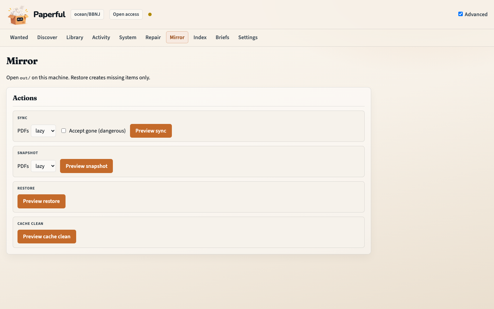

# Tidy a collection: lint, identifiers, duplicates

Hygiene sits **around** a fill, not inside it. Nothing merges or rewrites
titles until you say so.

## Outcome

You will have turned **Advanced** on (reveal only), run **lint** as a
read-only report, previewed identifier fixes, and reviewed a duplicate pack
before any `--apply`-shaped write.

## Starting point

Workbench at http://127.0.0.1:8765. Scope a collection on **Library** first
so Repair does not walk the whole library by accident.

A fill is optional. Many people tidy **before** Grab when the collection was
imported from a messy RIS dump; others tidy **after** when Grab attached a
second copy of the same paper.

## What you’ll do

1. Toggle **Advanced** (cookie; does not enable Scholar or a local model).
2. Open **Repair**.
3. Preview **lint** (report only).
4. Preview **fix-metadata**, then Apply if the pack looks right.
5. Preview **dedupe**, read the pack on disk, then Apply keepers.

## Walkthrough

1. Set the collection chip. Toggle **Advanced** in the header. Extra nav
   appears: Repair, Mirror, Index, Briefs, Settings.

2. Open **Repair**. Each verb is Preview (dry-run + review token) then
   Apply (consumes the token). Stale previews return HTTP 409.


3. **lint** — Preview writes the report. Lint is read-only; there is no
   Apply that “fixes lint”. Read the findings, then use **fix-metadata**.

4. **fix-metadata** — Preview proposes identifier and title patches on
   disk. Apply writes them to the catalogue. `run` / Grab never write
   bibliographic fields.

5. **dedupe** — Preview writes a review pack under `state/dedupe-packs/`.
   Read it. Apply copies the spare parent’s PDF, notes, and better fields
   onto the keeper, then moves that emptied parent to the Zotero trash.
   Title+year merges need an extra confirmation (the **medium** checkbox).
   Details: [Dedupe](dedupe.md).

6. **attachments** (same page, further down) reports ghosts, broken links,
   and duplicate files. It does not change Zotero unless you pass a surgery
   flag **and** Apply. `--link` is that surgery, not the stranger path.

7. **Mirror** (next nav item) is snapshot / restore / cache — the folder
   copy, not metadata repair.



## What to notice

- Advanced is a **reveal**. It does not turn on Scholar, Sci-Hub, or LLM.
- Dedupe is not in `paperful all` by default. Run it when the collection is
  messy, usually before a big Grab.
- Restore creates only what the live catalogue is missing. It does not
  overwrite fields already there.

## You should now have…

A lint report, optional identifier writes, and (if you applied dedupe)
one keeper per duplicate pack.

## CLI equivalent

```sh
docker compose run --rm paperful lint -C ocean/BBNJ
docker compose run --rm paperful fix-metadata -C ocean/BBNJ
docker compose run --rm paperful fix-metadata -C ocean/BBNJ --apply
docker compose run --rm paperful dedupe -C ocean/BBNJ
# read state/dedupe-packs/*.md
docker compose run --rm paperful dedupe -C ocean/BBNJ --apply
docker compose run --rm paperful attachments -C ocean/BBNJ
```

## Next

- [First fill](first-fill.md) once identifiers are honest
- [How it works — Around a fill](how-it-works.md#around-a-fill)
- [Workflows](workflows.md) for `paperful all` and saved run configs
